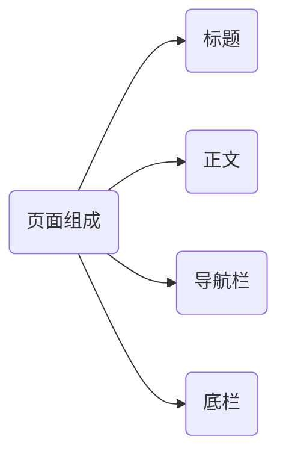

# HTML

> 构建网页的框架

HTML:超文本标记语言

特点:

- 不仅可以对文字进行定义,还可以对图片,视频进行定义
- 由标签构成的语言
  - 例如`<a>`展示超链接,``展示图片,`<video>`展示视频
  - 可直接在浏览器运行和编译
  - 对大小写不敏感
  - 语法结构不太严格

## `HTML`以及`css`样式网站

[https://www.w3school.com.cn/](https://www.w3school.com.cn/)

## `HTML`入门

```html
<html>
    <head>
        <title> 你的标题 </title>
    </head>
    <body>
        内容
    </body>
<html>
```

`<html>`:`HTML`语言标签,告诉浏览器使用html的解析方式
`<head>`:网页上面的标题
`<body>`:网页的主体内容

```html
<html>
  <head>
    <title>Your title</title>
  </head>
  <body>
     The text beside your picture
    <h1>Your h1 text </h1>

    <hr>
    <!---The Line--->
    The text
    <hr>
```

## HTML基础标签以样式

### 页面组成



#### 标题样式1(设置和调用`CSS`)

`HTML`:

- 图片标签:``
  - `src`:指定图片的url(绝对路径(网络/本地)/相对路径(相对于当前文件的路径))
  - `width`:宽度(px)/父元素的百分比(放在`<body>`下就是整个页面的百分比)
  - `height`:高度(px)/父元素的百分比
- 标题标签:`<h1>` - `<h6>`
- 水平线标签:`<hr>`

`CSS`:

- color(一般不用记,可以在网站查到)
  - 关键词:red/green
  - rgb设置:rgb(255,255,255)
  - 十六进制:ff0000

`CSS`引入方式:

- 行内样式:写在标签的`style`属性中(不推荐)

```html
<h1 style = "xxx:xxx; xxx:xxx"(xxx指的是style样式和参数);>文字</h1>

<h1 style = "color:red;"(xxx指的是style样式和参数);>文字</h1>
```

- 内嵌样式:卸载`style`标签中(一般写在`head`标签中)

```html
<style>
  h1 {
    xxx:xxx;
    xxx:xxx;
  }
</style>

<style>
  h1 {
    color:red;
  }
</style>
```

- 外联样式:写在一个单独的`css`文件中(需要通过`link`标签引入)

```css
h1 {
  color:red;
  color:rgb(255,255,255);
  color:#ff0000;
}
```

```html
<link rel="stylesheet" href="style.css">
```

#### 标题样式2(通过`css`选择器应用数学)

`CSS`参数:font-size(一般不用记):

- px(像素)
- %(元素百分比)

`<span>`:无意义标签

`css`选择器(用来选取需要设置的元素,即标签)

- 元素选择器(优先级低)

```css
元素名称 {
  color:red;
}
```

```css
h1 {
  color:red;
}
```

```html
<h1>Text</h1>
```

- id选择器(优先级高)

```css
#id属性值 {
  color:red;
}
```

```css
#hid {
  color:red;
}
```

```html
<h1 id = "hid">Text</h1>
```

- 类选择器(优先级中)

```css
.class属性 {
  color:red;
}
```

```css
.cls {
  color:red;
}
```

```html
<h1 class = "cls">Test</h1>
```

#### 标题超链接

- 定义超链接:`<a>`
  - `href`:目标连接
  - `target`:在什么位置打开
    - `_blank`:新的浏览器窗口
    - `_sel`f:在此窗口打开

```html
<a href="baidu.com" target="_blank"></a>
```

#### 正文排版

`HTML`:

- 视频标签：`<video>`
  - `src`: 规定视频的url
  - `controls`: 显示播放控件
  - `width`: 播放器的宽度
  - `height`: 播放器的高度

```html
<video src="video.mp4" controls width="300" height="200"></video>
```

- 音频标签：`<audio>`
  - `src`: 规定音频的url
  - `controls`: 显示播放控件

```html
<audio src="audio.mp3" controls></audio>
```

- 段落标签：`<p>`

```html
<p>这是一个段落。</p>
```

- 文本加粗标签：`<b>/<strong>`

```html
<b>加粗文本</b>
<strong>强调文本</strong>
```

- 换行:`<br>`

```html
第一行<br>第二行
```

`CSS`:

- `line-height`:设置行高

```css
p {
  line-height: 1.6;
}
```

- `text-indent`:定义第一个行内容的缩进

```css
p {
  text-indent: 2em;
}
```

- `text-align`:规定元素中的文本的水平对齐方式

```css
p {
  text-align: center;
}
```

#### 正文布局

盒子模型:

- 盒子: 页面中所有的元素(标签)都可以看做是一个**盒子**, 由盒子将页面中的元素包含在一个矩形区域内,通过盒子的视角更方便的进行页面布局
- 盒子模型组成:内容区域(`content`)、内边距区域(`padding`)、边框区域(`border`)、外边距区域(`margin`)


- 布局标签: 实际开发网页中, 会大量频繁的使用 div and span 这两个没有语义的布局标签.
- 标签: `<div>` `<span>`
- 特点:
  - div标签:
    - 一行只显示一个 (独占一行)
    - 宽度默认是父元素的宽度, 高度默认由内容撑开
    - 可以设置宽高 (width, height)
  - span标签:
    - 一行可以显示多个
    - 宽度和高度默认由内容撑开
    - 不可以设置宽高 (width, height)

`CSS`:

- `width`: 设置宽度

```css
div {
  width: 100px;
}
```

- `height`: 设置高度

```css
div {
  height: 200px;
}
```

- `border`:设置边框的属性,如:1px solid #000;

```css
div {
  border: 1px solid #000;
}
```

- `padding`:内边距

```css
div {
  padding: 10px;
}
```

- `margin`: 外边距

```css
div {
  margin: 20px;
}
```

居中展示框架:

```css
#center {
  width: 65%;
  /* margin: 0% 17.5% 0% 17.5%; */ /* 外边距，上 右 下| 左 */
  margin: 0 auto;
}
```

### 其他标签

#### 表格标签

|标签 |描述 |属性/备注 |
|:---:|:---:|:---:|
|`<table>` |定义表格整体, 可以包裹多个 `<tr>` |`border`: 规定表格边框的宽度 `width`: 规定表格的宽度 `cellspacing`: 规定单元之间的空间。 |
|`<tr>` |表格的行, 可以包裹多个 `<td>` |   |
|`<td>` |表格单元格(普通), 可以包裹内容 |如果是表头单元格, 可以替换为 `<th>` |

例:


```html
<table border="1px" cellspacing="0" width="600px">
  <tr>
    <th>序号</th>
    <th>品牌Logo</th>
    <th>品牌名称</th>
    <th>企业名称</th>
  </tr>
  <tr>
    <td>1</td>
    <td></td>
    <td>华为</td>
    <td>华为技术有限公司</td>
  </tr>
  <tr>
    <td>2</td>
    <td></td>
    <td>阿里</td>
    <td>阿里巴巴集团控股有限公司</td>
  </tr>
</table>
```

#### 表单标签

- 场景: 在网页中主要负责数据采集功能, 如注册、登录等数据采集。
- 标签: `<form>`
- 表单项: 不同类型的 `input` 元素、下拉列表、文本域等。
  - `<input>`: 定义表单项, 通过`type`属性控制输入形式
  - `<select>`: 定义下拉列表
  - `<textarea>`: 定义文本域
- 属性:
  - `action`: 规定当提交表单时向何处发送表单数据, URL
  - `method`: 规定用于发送表单数据的方式。GET、POST

> 表单项中一定要有**name**属性才能提交

例:


```html
<form action="" method="post">
  用户名：<input type="text" name="username">
  年龄：<input type="text" name="age">
  <input type="submit" value="提交">
</form>
```

- `<input>`表单项

|type取值 |描述 |
|:---:|:---:|
|`text` |默认值，定义单行的输入字段 |
|`password` |定义密码字段 |
|`radio` |定义单选按钮 |
|`checkbox` |定义复选框 |
|`file` |定义文件上传按钮 |
|`date/time/datetime-local` |定义日期/时间/日期时间 |
|`number` |定义数字输入框 |
|`email` |定义邮件输入框 |
|`hidden` |定义隐藏域 |
|`submit / reset / button` |定义提交按钮 / 重置按钮 / 可点击按钮 |
