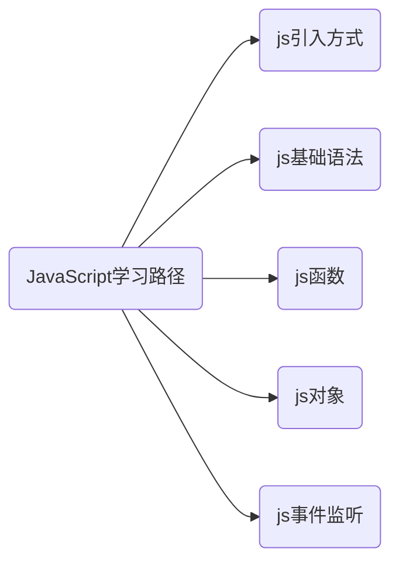

# JavaScript

>控制网页的交互行为

## 目录



### js引入方式

- 内部脚本: 将JS代码定义在HTML页面中
  - JavaScript代码必须位于`<script></script>`标签之间
  - 在HTML文档中, 可以在任意地方, 放置任意数量的`<script>`
  - 一般会把脚本置于`<body>`元素的底部, 可改善显示速度

- 外部脚本: 将JS代码定义在外部JS文件中, 然后引入到HTML页面中
  - 外部JS文件中, 只包含JS代码, 不包含`<script>`标签
  - `<script>`标签不能自闭合

- 内部脚本

```html
<script>
    alert("Hello World")
</script>
```

- 外部脚本

```html
<script src = "path"></script>
```

## js基础语法

### js书写语法

>大部分和java差不多

- 使用window.alert()写入警告框

#### 输出语句

```javascript
window.alert("Hello JavaScript"); // 浏览器弹出警告框
```

- 使用document.write()写入HTML输出

```javascript
document.write("Hello JavaScript"); // 写入HTML, 在浏览器展示
```

- 使用console.log()写入浏览器控制台

```javascript
console.log("Hello JavaScript"); // 写入浏览器控制台
```

### 变量

使用`var`关键词声明变量

特点:

- JavaScript是弱类型变量,可以存放不同值
- 作用域比较大,全局变量

新特性:

- `let`关键词:相当于局部变量
- `const`关键词:相当于常量

### 数据类型,运算符,流程控制语句

数据类型:

- `number`:数字(包括NaN,即Not a Number)
- `string`:字符串
- `boolean`:布尔值
- `null`:对象为空
- `undefined`:当变量对象未初始化的时候,变量默认值是`undefined

`typeof`:获取数据类型(typeof(null)获取到的是`object`)

运算符:

- 和Java一样
- `==`和`===`
  - `==`:会进行类型转换(var a = 10; a == "10"// `true`)
  - `==`:不会进行类型转换(var a = 10; a === "10"// `false`)
- 字符串类型转为数字: 将字符串字面值转为数字. 如果字面值不是数字, 则转为`NaN`.

```javascript
parseInt("123"); // 123
parseInt("abc"); // NaN
```

- 其他类型转为boolean:
  - Number: `0`和`NaN`为false, 其他均转为true.
  - String: 空字符串为false, 其他均转为true.
  - Null和undefined: 均转为false.

```javascript
Boolean(0);      // false
Boolean(NaN);    // false
Boolean(123);    // true
Boolean("");     // false
Boolean("hello");// true
Boolean(null);   // false
Boolean(undefined); // false
```

流程控制:

- 和Java一样

### 函数

- 介绍: 函数(方法)是被设计为执行特定任务的代码块.
- 定义: JavaScript函数通过`function`关键字进行定义

方式1:

```javascript
function functionName(参数1, 参数2..) {
  // 要执行的代码
}
```

- 注意:
  - 形式参数不需要类型. 因为JavaScript是弱类型语言
  - 返回值也不需要定义类型, 可以在函数内部直接使用`return`返回即可

- 调用: 函数名称(实际参数列表)

```javascript
// 定义函数
function add(a, b) {
  return a + b;
}

// 调用函数
let result = add(1, 2); // result = 3
```

方式2:

```javascript
var functionName = function(参数1, 参数2..) {
  // 要执行的代码
};

var add = function(a, b) {
  return a + b;
};
```

### 对象

- 基础对象(`Array``String``Json`)
- `BOM`浏览器对象
- `DOM`文档对象

#### `Array`

- 介绍: JavaScript中Array对象用于定义数组

- 定义: 有两种方式定义数组

```javascript
// 方式一: 使用new Array()
var arr1 = new Array(1, 2, 3, 4);

// 方式二: 使用字面量
var arr2 = [1, 2, 3, 4];
```

- 访问: 通过索引访问和赋值

```javascript
arr[索引] = 值;
arr[10] = "hello";
```

- 注意事项: JavaScript中的数组相当于Java中集合，数组的长度是可变的，而JavaScript是弱类型，所以可以存储任意的类型的数据

```javascript
var arr = [1, "hello", true, null]; // 可以存储不同类型的数据
arr[10] = "new value"; // 数组长度会自动扩展
```

- Array对象的属性和方法:

| 属性 | 描述 |
|:---:|:---:|
| `length` | 设置或返回数组中元素的数量。 |

| 方法 | 描述 |
|:---:|:---:|
| `forEach()` | 遍历数组中的每个有值的元素，并调用一次传入的函数 |
| `push()` | 将新元素添加到数组的末尾，并返回新的长度。 |
| `splice()` | 从数组中删除元素。 |

```javascript
// length属性的使用
let arr = [1, 2, 3, 4];
console.log(arr.length); // 4

// forEach方法的使用
arr.forEach(function(item) {
  console.log(item);
});

// push方法的使用
arr.push(5);
console.log(arr); // [1, 2, 3, 4, 5]

// splice方法的使用
arr.splice(2, 1); // 从索引2开始删除1个元素
console.log(arr); // [1, 2, 4, 5]
```

#### `String`

- 介绍: String字符串对象创建方式有两种

```javascript
// 方式一: 使用new String()
var str1 = new String("Hello String");

// 方式二: 使用字面量
var str2 = "Hello String";
```

- 属性: `length` - 字符串的长度

```javascript
var str = "Hello World";
console.log(str.length); // 11
```

- 方法:

| 方法 | 描述 |
|:---:|:---:|
| `charAt()` | 返回在指定位置的字符 |
| `indexOf()` | 检索字符串 |
| `trim()` | 去除字符串两边的空格 |
| `substring()` | 提取字符串中两个指定的索引号之间的字符 |

```javascript
// charAt()示例
var str = "Hello";
console.log(str.charAt(0)); // "H"

// indexOf()示例
console.log(str.indexOf("l")); // 2

// trim()示例
var str2 = "  Hello  ";
console.log(str2.trim()); // "Hello"

// substring()示例
console.log(str.substring(0, 2)); // "He"
```

#### `JSON`

- 定义格式: 使用对象字面量定义对象

```javascript
var 对象名 = {
  属性名1: 属性值1,
  属性名2: 属性值2,
  属性名3: 属性值3,
  函数名称: function(形参列表) {
    // 函数体
  }
};

// 示例
var user = {
  name: "Tom",
  age: 20,
  gender: "male",
  eat: function() {
    alert("用膳~");
  }
};
```

- 调用格式:

```javascript
// 访问属性
对象名.属性名;
console.log(user.name); // 输出: Tom

// 调用方法
对象名.函数名();
user.eat(); // 弹出: 用膳~
```

- 概念: `JSON` (JavaScript Object Notation) 是通过JavaScript对象标记法书写的文本。
- 用途: 由于其语法简单, 层次结构鲜明, 现多用于作为数据载体, 在网络中进行数据传输。

- JavaScript对象写法:

```javascript
{
  name: "Tom",
  age: 20,
  gender: "male"
}
```

- JSON格式写法:

```json
{
  "name": "Tom",
  "age": 20,
  "gender": "male"
}
```

- 主要区别: JSON中所有属性名必须用双引号包裹, JavaScript对象中属性名引号可选

- JSON字符串转为JS对象: 使用`JSON.parse()`方法

```javascript
// 定义一个JSON字符串
var userStr = '{"name": "Tom", "age": 20, "gender": "male"}';

// 将JSON字符串转换为JS对象
var jsonObject = JSON.parse(userStr);
console.log(jsonObject); // 输出: {name: "Tom", age: 20, gender: "male"}

// 访问对象的属性
console.log(jsonObject.name); // 输出: "Tom"
console.log(jsonObject.age);  // 输出: 20
```

- JS对象转为JSON字符串: 使用`JSON.stringify()`方法

```javascript
// 定义一个JS对象
var user = {
  name: "Tom",
  age: 20,
  gender: "male"
};

// 将JS对象转换为JSON字符串
var jsonStr = JSON.stringify(user);
console.log(jsonStr); // 输出: '{"name":"Tom","age":20,"gender":"male"}'
```

#### `BOM`

>浏览器对话模型

构成:

- `Window`: 浏览器窗口对象

```javascript
// 弹出警告框
window.alert("Hello World");
```

- `Navigator`: 浏览器对象

```javascript
// 获取浏览器信息
console.log(navigator.userAgent);
```

- `Screen`: 屏幕对象

```javascript
// 获取屏幕宽度
console.log(screen.width);
```

- `History`: 历史记录对象

```javascript
// 返回上一页
history.back();
```

- `Location`: 地址栏对象

```javascript
// 获取当前页面URL
console.log(location.href);
```

#### `DOM`

>文档对象模型

当浏览器解析完`HTML`文档之后会将文档中的各个部分封装成以下对象,JavaScript通过`DOM`就可以对`HTML`进行操作

- `Document`: 整个文档对象
- `Element`: 元素对象
- `Attribute`: 属性对象
- `Text`: 文本对象
- `Comment`: 注释对象

```html
<!DOCTYPE html>
<html lang="en">
<head>
    <meta charset="UTF-8">
    <meta name="viewport" content="width=device-width, initial-scale=1.0">
    <title>Document</title>
</head>
<body>
    <h1>DOM对象</h1>
    <a href="www.baidu.com">属性对象</a>
</body>
</html>
```

>`DOM`树


- HTML中的Element对象可以通过Document对象获取，而Document对象是通过window对象获取的。

- Document对象中提供了以下获取Element元素对象的函数:
  - 根据id属性值获取，返回单个Element对象
  `var h1 = document.getElementById('h1');`
  - 根据标签名称获取，返回Element对象数组
  `var divs = document.getElementsByTagName('div');`
  - 根据name属性值获取，返回Element对象数组
  `var hobbys = document.getElementsByName('hobby');`
  - 根据class属性值获取，返回Element对象数组
  `var clss = document.getElementsByClassName('cls');`

### 事件监听

事件:发生在`HTML`上的事件:

- 按钮被点击
- 鼠标移动到元素上
- 按下键盘按键

方式一：通过 HTML标签中的事件属性进行绑定

```html
<input type="button" onclick="on()" value="按钮1">
<script>
function on() {
  alert('我被点击了！');
}
</script>
```

方式二：通过DOM元素属性绑定

```html
<input type="button" id="btn" value="按钮2">
<script>
document.getElementById('btn').onclick = function() {
  alert('我被点击了!');
}
</script>
```

常见事件(可放在任意标签下):

| 事件名       | 说明                         |
|:----------:|:--------------------------:|
| `onclick`    | 鼠标单击事件               |
| `onblur`     | 元素失去焦点               |
| `onfocus`    | 元素获得焦点               |
| `onload`    | 页面或图像加载完成时触发       |
| `onsubmit`  | 表单提交时触发该事件         |
| `onkeydown` | 键盘按键按下                 |
| `onmouseover` | 鼠标移到某元素之上         |
| `onmouseout` | 鼠标从某元素移开           |
