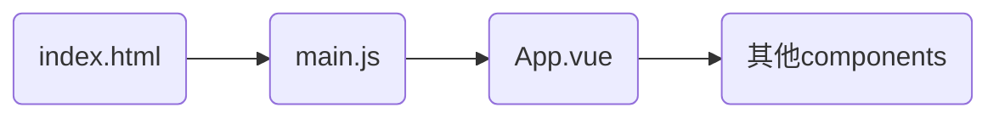
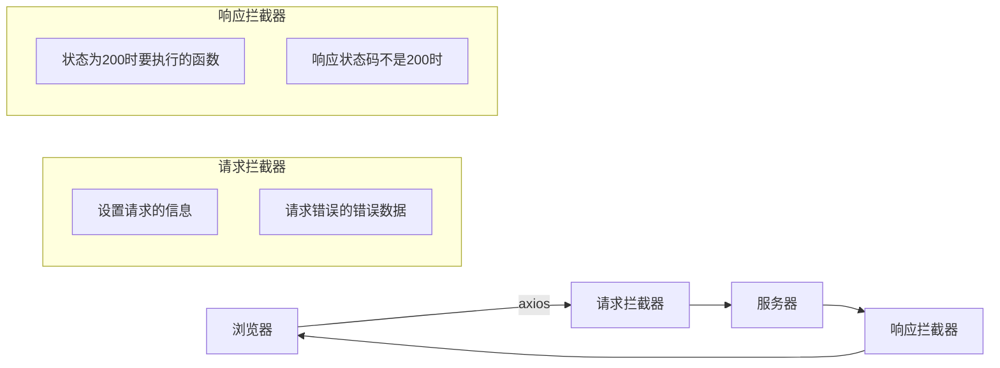

# Vue

核心功能:

- 声明式渲染:基于标准HTML扩展的一套模板语法
- 响应性:Vue会自动追踪js状态并实时更新DOM

## 快速体验

```js
<script>
    const app = new Vue.createApp({
        setup(){
            
        }

        return {

        }
    })
<script>
```

在setup中定义变量,在return中返回,再使用Vue命令绑定相对于的元素就可以与HTML关联了

## Vite

用来创建和打包一个基础的满足Vue3的Project

创建项目命令

```bash
npm create vite@latest
npm install //进入创建好的文件夹内执行
npm run dev //启动项目
```

## Vue3目录

- `public/`：公共资源（HTML、图像、字体），直接复制到构建目录

- `src/`：源代码，由Vite实时编译

### src/ 内部划分

1. `assets/`：静态资源（图片、字体、样式）
2. `components/`：可复用的UI组件
3. `layouts/`：布局组件（头部、底部、导航）
4. `pages/`：页面级组件，对应路由
5. `plugins/`：Vite插件配置
6. `router/`：Vue路由配置
7. `store/`：Vuex状态管理
8. `utils/`：通用工具函数

- `vite.config.js`：Vite配置文件

- `package.json`：Node.js项目配置

- `src/main.js`：项目入口文件

## SFC入门

SFC:单文件组件,传统页面有html,css,js文件,Vue将他们封装成一个文件(Single-File Component),分别由`<template>`,`<style>`,`<script>`标签组成

多个页面可能存在相同的部分,复用率极高,于是将他们分离出来,做成组件,于是页面就变成了由各个组件组成的页面

项目过程:



1.在index中引入main.js
2.在main.js初始化App对象
3.在App.vue中引入其他组件,通过标签使用组件,例:

```js
<script setup>
import HelloWorld from './components/HelloWorld.vue'
</script>

<template>
  <HelloWorld msg="Vite + Vue" />
</template>
```

css导入方式:

- 在`<script>`标签中导入
- 在`<script>`标签中导入,但是要加@(@import)
- 在main.js中导入,作用到全局

## Vue3语法

### setup函数和响应式数据

在`<script>`标签后面加上setup,即可省略return等复杂的语法结构

使用vue的ref()函数可将变量变为响应式函数

```js
<script setup>
    import {ref} from 'vue'

    let counter = ref{0} //相当于创建了一个对象,在<script>标签中使用该变量都要加.value才能对此变量进行操作
    
    function add() {
        counter.value++
    }
</script>

<template>
    <div>
        <span v-text="counter"></span> //在<template>标签中不用加.value
    </div>
</template>

```

### 插值表达式

```js
<script>
    let PI = 3.14
</script>

<template>
    <h1>{{ PI }}</h1>
```

特点:

- 可将数据绑定到元素上面
- 可将函数的返回值渲染到指定位置
- 支持一些运算符({{ age > 18 ? '是' : '否' }})
- 支持调用api({{ str.reverse() }})

### Vue指令

- v-xxx:vue的指令
  - 要求:
    - 命令必须依赖标签,放在开始标签中
  - v-text:用来渲染文本(v-text="你好")
    - 支持模板字符串(v-text="\`你好 ${hello}\`")
    - 支持常见api调用
    - 支持调用函数
    - **不支持**html格式
  - v-html:用来渲染html格式(v-html="\<h1>你好\<h1>")
    - 专门用来渲染html格式
  - v-bind:将数据绑定到元素的属性上(v-bind:属性="")
  - v-on:监听DOM操作(v-on:click=""或者@click)
    - 在原生js中的onClick之类的操作要吧on去除
    - 内联事件:`<button v-on:click="counter++" >+</button>`
    - .once事件只绑定一次:`<button v-on.once:click="counter++" >+</button>`
    - .prevent事件取消默认行为(例如\<a>可以跳转连接,加入修饰符可以阻止)

### 响应式数据处理

变量定义:

```js
<script setup>
    import {ref} from 'vue'

    let counter = ref{0}
</script>
```

对象定义:

```js
<script setup>
    import {reactive} from 'vue'

    let people = reactive(
        name:"",
        age:""
    )
</script>
```

- toRef():将reactive中的某个数据转换成ref数据
- toRefs():将reactive中多个数据转换成ref数据(属性名要相同)

### 条件渲染

- v-if:在某些条件下渲染对应元素(\<h1 v-if="true">Hello\<h1>)
  - v-else:当v-if为false时自动渲染
    - 需要和v-if搭配
- v-show:和v-if使用方法相同,但v-if的条件为false时不会被渲染,v-show无论怎么样都会被渲染但是通过css样式隐藏
  - v-if有更多的切换开销,v-show有更多的渲染开销

### 列表渲染

- v-for:用来渲染列表(迭代,也能添加响应式数据)

```js
<script setup>
import { reactive } from 'vue';

let person = reactive({
  person1 :{
    name:"xiaoming",
    age:"18"
  },
  person2 :{
    name:"xiaohong",
    age:"18"
  },
  person3 :{
    name:"xiaoqing",
    age:"18"
  },
  person4 :{
    name:"xiaofang",
    age:"18"
  }
})
</script>
<template>
  <div id="app">
    <ul>
      <li v-for="personit in person">
        {{ personit }} //自动渲染出集合里面的元素
      </li>
    </ul>
    
  </div>
</template>
```

### 双向绑定

- 单向绑定(v-bind):当用户的操作对响应式数据进行了修改的时候只会更新DOM树,不会更新响应式数据
- 双向绑定(v-model):当用户当用户的操作对响应式数据进行了修改的时候不仅会更新DOM树,也会更新响应式数据

### 属性计算

`computed()`函数:计算属性

>若computed()函数中的响应式数据没发生改变,不管调用多少次都是渲染上次的结果,效果相当于优化,而使用普通的函数每刷新一次页面都会加载一次

```js
let num1 = ref(2)
let num2 = ref(3)

let value = computed(() => {
  num1 > num2 ? "否":"是"
}) //箭头函数
```

### 数据监听器

应用场景:

- 当数据发生变化时需执行相对应的操作
- 监听数据变化,当满足一定条件之后触发操作
- 在异步操作前或操作后执行相对于的操作

不同函数

- watch()

>value为需要监听的响应式数据,newValue是变化后的值,old是变化前的值,deep是是否执行深度搜索的选项,immediate是是否立即渲染

```js
//监听ref
watch(value,(newValue,oldValue) => {
})

//监听一个reactive
watch(() => object.value,(newValue,oldValue) => {
})

//监听多个reactive
watch(() => object.value,(newValue,oldValue) => {
},{deep=true,immediate:true})
```

- watchEffect()

>当任何一个数据发生变化时候都执行,无传入参数

### Vue生命周期

在初始化Vue组件的时候会运行一些配置,其中就会运行生命周期的钩子函数,我们便可以在钩子函数添加自己的代码


>红色的为钩子函数

详细的看VueApi(`https://cn.vuejs.org/guide/essentials/lifecycle.html`)

重写生命周期函数

```js
import { onMounted,onActivated,onBeforeMount,onBeforeUnmount,onBeforeUpdate,onUpdated } from 'vue';

//重写方式
onMounted(() => {
})
```

### Vue组件(SFC)拼接页面

将页面分成几个部分,然后每个部分都用vue文件替代,再写css调整位置

### Vue组件参数传递

- 父传子(组件)
- 子传父(组件)
- 兄弟互传(组件)
  - 需要先传给父组件再传给兄弟组件

在后面的router或pinia中会详细地提及

## Router机制

- 根据不同的url跳转到不同的内容或页面
- 例如:/home -> home.vue; /list -> list.vue
- 通过路由的文件定义路径和组件的关系

### Router初步

- App.vue

```js
<router-view></router-view> //该标签相当于占位,配置了路由只会会被替换成相对应的组件
```

- router.js

>配置路由

```js
import {createRouter,createWebHashHistory} from 'vue-router'
import Vue from '../components/Vue.vue'
import HelloWorld from '../components/HelloWorld.vue'

const router = createRouter({
    history:createWebHashHistory(), //不同的历史模式
    router:[
        {
            path:"/",
            component:Vue
        },
        {
            path:"/HelloWorld",
            component:HelloWorld
        }
    ]
})

export default router //暴露给main.js
```

- main.js

```js
app.use(router);
```

- App.vue

```js
<router-view></router-view> //在想渲染的地方放上标签
<router-link to=""></router-link> //或者指定特定路径
```

---

或者可以在\<router-link>中指定名字,展示到特定页面

- App.vue

```js
<router-view name="home"></router-view>
```

- router.js

```js
routes:[{
  path:'/home'.
  component:{
    home:Home //名字对应标签页
  }
}]
```

### 编程式Router

以上的都是声明式路由

编程式路由:

```js
<script setup>
import HelloWorld from './components/HelloWorld.vue'
import router from './routers/router';

function goHelloWorld(){
  router.push("/HelloWorld")
}

function goVue() {
  router.push("/Vue")
}

</script>

<template>
  <div>
    <a href="https://vite.dev" target="_blank">
      
    </a>
    <a href="https://vuejs.org/" target="_blank">
      
    </a>
  </div>
  <router-view></router-view>
  <Button @click="goHelloWorld()">HelloWorld</Button> <br> //点击特定按钮的时候跳转
  <Button @click="goVue">Vue</Button>
</template>

<style scoped>
.logo {
  height: 6em;
  padding: 1.5em;
  will-change: filter;
  transition: filter 300ms;
}
.logo:hover {
  filter: drop-shadow(0 0 2em #646cffaa);
}
.logo.vue:hover {
  filter: drop-shadow(0 0 2em #42b883aa);
}
</style>
```

### 路由传参

- 参数方式
  - 键值对参数:/user?id=1&name=hello
  - 路径参数:/user/1/hello

#### 路径传参

- 设置路径参数
- router.js

```js
routes:[
  {
    path:"user/:id/:name", //通过冒号方式设置参数
    component:User
  }
]
```

- 接收参数
- User.vue

```js
<script setup>
  import { useRoute } from 'vue-router';
  let route = useRoute()
  let id = route.params.id //从route上获取参数,名字要和在router.js中定义的一样
  let name = route.params.name //从route上获取参数
</script>
```

编程式路由

- 使用push设置路径

#### 键值对传参

- 设置键值对参数
- router.js

```js
routes:[
  {
    path:"user", //不用做任何改变
    component:User
  }
]
```

- 接收参数
- User.vue

```js
<script setup>
  import { useRoute } from 'vue-router';
  let route = useRoute()
  let id = route.query.id //从route上获取参数,名字要和在router.js中定义的一样
  let name = route.query.name //从route上获取参数
</script>
```

### 路由守卫

- 路由守卫:在路由切换期间进行一些特定任务的回调函数
  - 全局前置守卫:在路由切换前被调用,用于验证用户是否登录等
  - 全局后置守卫:在路由切换后被调用,用于处理数据等
- 位置:router.js文件中

>前置守卫

- 参数
  - to:从哪来
  - from:到哪去
  - next:放行函数
    - next():直接放行
    - next("/path"):重定向(谨慎使用,可能会造成死循环)

```js
router.beforeEach(
  (to,from,next) => {

  }
)
```

```js
router.afterEach(
  (to,from) => {

  }
)
```

## Axios

### 普通函数和回调函数的区别

解决回调函数问题的机制

- 普通函数:调用了函数之后才执行代码
- 回调函数:基于事件的自动调用的函数
  - 承诺进行中(`pending`):其他代码继续执行
  - 承诺成功(`resolved`):准备好成功时的预案
  - 承诺失败(`reject`):准备好失败时的预案

### Promise

- Promise:一个保存未来才会结束的事件的结果
  - 一旦状态改变就不会再变

>声明Promise对象,判断什么时候改变Promise的状态

```js
let promise = new Promise(function (resolve,reject){
  if(....) {
    resolve(values...)
  }

  if(....) {
    reject(values)
  }
})
```

>定义当Promise状态发生改变的时候会执行的代码

```js
promise.then(
  function(values...){
    //resolve
  },
  function(values...){
    //reject
  }
)
```

#### async和await

- async:用于简化获取promise对象的关键词
  - let promise = new Promise(function (resolve,reject){}) = async function(resolve,reject) {}
  - 如果方法正常return结果,promise状态就是resolve,return后的结果就是成功状态后的值,并且return的值可以在resolve中被接收
  - 如果方法出现异常,则返回的promise状态就是reject,并且异常信息也可以在reject中被接受
  - 若async中返回的内容是一个promise对象,则状态由内部的promise对象状态决定

```js
let promise1 = async () => {
  return 1
}

let promise2 = async () => {
  throw new Error("reject")
}

promise1.then(
  function(values) {
    console.log(values) //控制台输出1
  },
  function() {}
)

promise2.then(
  function(){},
  function(values) {
    console.log(values) //控制台输出reject
  }
)
```

- await:用于获取promise对象的返回值
  - 若await右边是一个resolve的promise,则返回成功状态的返回值
  - 若await右边是一个reject的promise,则直接抛异常
  - await关键词必须在async修饰的函数中使用
  - 在同一个函数内,await后面的代码会等await中的代码执行完毕之后再执行下面的代码

### Axios使用

使用axios获取api内容资源

- 获取请求
  - 参数:响应三要素
    - 请求方式:get/post
    - 请求url:api.xxx.com
    - 请求参数: key:value/json

```js
//axios返回回来的对象是promise
let promise = axios({
  method:"get",
  url:"https://api.xxx.com/api",
  
  //若请求方式是post,则这一段会以json方式放入请求体
  data:{
    key:value
  }
  //都是以键值对方式放在后面
  params:{
    key:value
  }
})
```

- 获取response
  - 内容:
    - data:响应回来的数据
    - status:响应状态状态码
    - statusText:响应状态描述
    - headers:本次响应的响应头
    - config:本次请求的配置信息
    - request:XMLHttpRequest对象

```js
async function getapi() {
  const data = await promise.data; //获取返回的内容
}
```

### Axios的get和post方法

- get方法
  - 参数:
    - url:api.xxx.com
    - params:{key:value}键值对参数
    - header:特殊的请求头

```js
axios.get(
  "https://api.xxx.com",
  {
    params:{
      key:value
    }
  }
)
```

- post方法:
  - 参数:
    - 和get方法一样,在url后面多了个请求体对象,在发送请求之后会转成json对象

```js
axios.post(
  "https:api.xxx.com",
  //这一行将会变成json对象
  {
    key:value
  },
  {
    params:{
      key:value
    },
    header:{

    }
  }
)
```

### Axios拦截器



```js
//设置初始化配置
const request = axios.create({
    baseURL:"api.xxx.com",
    timeout:20000
})

//创建请求拦截器
request.interceptors.request.use({
    //当请求成功时执行的代码
    function(config) {
      //当设置配置之后必须返回配置
      return config
    },
    //当请求失败时执行的代码
    function(error){
      //当出现异常时必须返回拒绝的promise对象
      return Promise.reject(error)
    }
})

//返回一个创建连接的对象
export default request
```

## Pinia

Pinia可以定义多个共享数据用于组件之间传递数据(但无法持久化,需结合sessionStorage和localStorage)

详细的看官方文档
