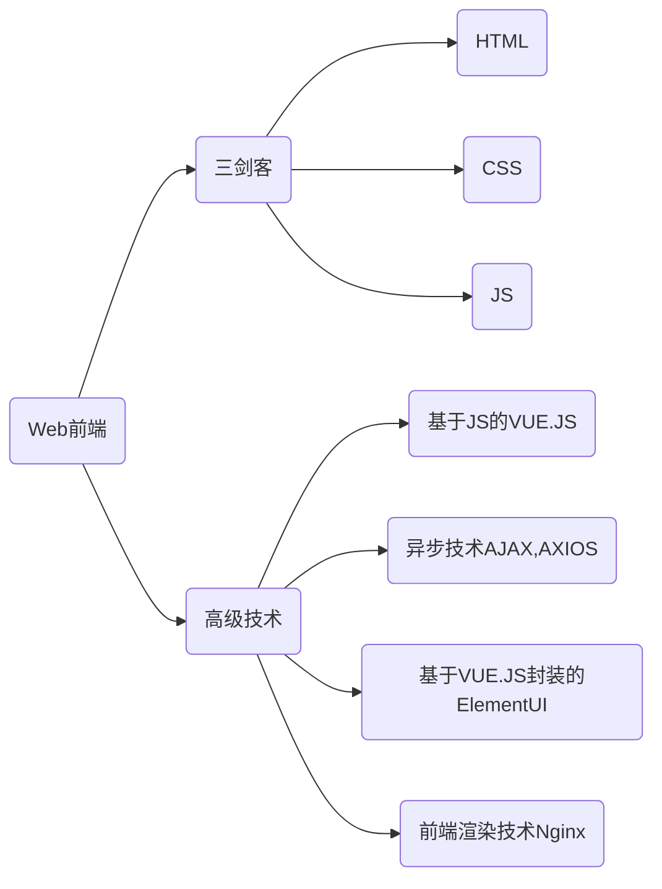

# 前端规范

## 前端组成

|组成|作用|
|:---:|:---:|
|`HTML`|负责网页的结构(页面元素和内容)|
|`CSS`|负责网页的表现(页面元素的外观,页面样式)|
|`JS`|负责网页的行为(页面的交互效果)|

```mermaid
graph LR
A(Web前端) --> B(三剑客)
B --> C(HTML)
B --> D(CSS)
B --> F(JS)
A --> G(高级技术)
G --> H(基于JS的VUE.JS)
G --> I(异步技术AJAX,AXIOS)
G --> J(基于VUE.JS封装的ElementUI)
G --> K(前端渲染技术Nginx)
```
