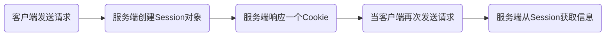
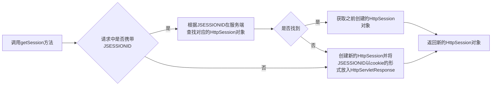

# 会话管理

HTTP是无状态协议,不会保存客户端和服务端的通信状态,此时就需要会话管理

例:网站的登陆状态

## 会话创建流程



## 会话管理方法

- Cookie
  - 在客户端保留少量数据,通过响应头向客户端响应一些客户端需要保留的信息
  - 当从响应中获取Cookie之后,再次访问该网站的任意资源请求头都会携带一个Cookie
  - 当重启浏览器之后Cookie会自动删除
- Session
  - 在服务端保留更多数据,通过HttpSession对象保存一些和客户端相关的信息
  - 服务端在给客户端创建Session之后,会自动将JSESSIONID以Cookie的形式放入响应对象,客户端以携带着JSESSIONID的Cookie登录时服务端就可以找到对应的Session
  - Session默认存活30分钟

## Cookie


响应Cookie

```java
@Override
    protected void service(HttpServletRequest req, HttpServletResponse resp) throws ServletException, IOException {
        Cookie cookie = new Cookie("CookieKey", "CookieValue");

        resp.addCookie(cookie);
    }
```

请求Cookie

```java
@Override
    protected void service(HttpServletRequest req, HttpServletResponse resp) throws ServletException, IOException {
        Cookie[] cookies = req.getCookies();
        for (Cookie cookie : cookies) {
            System.out.println(cookie.getName() + "\t" + cookie.getValue());
        }
    }
```

- Cookie的时效性
  - 会话级Cookie
    - Cookie数据存在于内存当中
    - 浏览器还存在Cookie就不会消失
  - 持久化Cookie
    - 服务端明确设置了Cookie的存在时间(`setMaxAge()`方法)
    - Cookie数据存在于硬盘
    - 到了预定时间就会被释放

Cookie没必要每次访问某个资源都携带Cookie,可以访问特定网站时使用特定Cookie(`setPath()`)

## Session


- 应用场景
  - 记录登录状态
  - 记录操作历史

Session不能new来创建,要使用getSession()方法



```java
HttpSession session = req.getSession(); //获取Session
boolean isNew = session.isNew(); //判断是否是新的Sesion
int id = session.getId(); //获取JSESSIONID

session.setAttribute(String str,Objet obj); //存放属性数据
```

## 域对象的使用

- 域对象:存储和传输数据的对象
  - 请求域:HttpServletRequest,一次请求以及请求转发,一般放请求业务有关的数据,例如查询到的部门信息
  - 会话域:HttpSession,一次会话内,可以跨多个请求,一般放客户端有关的信息,例如用户的登录信息
  - 应用域:ServletContext,本应用内,可以跨多个会话,一般放本应用程序有关的数据


