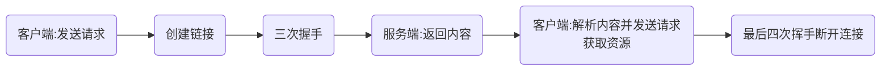

# HTTP协议

## HTTP介绍

`HTTP`:超文本传输协议(通常使用`HTTP/1.1`)

`HTTPS`:安全超文本传输协议

`HTTP`规定:

- 交互的方式
  - `REQUEST`(请求):客户端向服务端发送
  - `RESPONSE`(响应):服务端向客户端发送
- 数据的格式
  - 请求发送的数据称为请求报文
  - 响应发送的数据称为响应报文
- 报文格式:
  - 报文首部
    - 报文行
    - 报文头
    - 报文体

`HTTP`链接

- `HTTP`:应用层协议
- `TCP`:传输层协议
- `IP`:网络层协议

\[
客户端 \xrightarrow[四次挥手]{三次握手} 服务端
\]

流程图:



`HTTP/1.1`:

- 新增缓存机制
- 无序多次建立`TCP`连接

## HTTP请求和响应的报文格式

### 报文格式


### 请求报文

- 请求报文格式:
  - 请求首行 (请求行): `GET/POST 资源路径?参数 HTTP/1.1`
  - 请求头信息 (请求头)
  - 空行
  - 请求体: `POST`请求才有请求体

- 请求行组成部分
  - 请求方式 `GET`
  - 访问服务器的资源路径: 参数1=值1&参数2=值2 ...
  - 协议及版本 `HTTP/1.1`

#### GET方式

```http
GET /login.html?user=admin&pass=admin HTTP/1.1
```

```http
- 请求头
  - 主机虚拟地址
    - Host: localhost:8080
  - 长连接
    - Connection: keep-alive
    - 请求协议的自动升级[http的请求, 服务器却是https的, 浏览器自动会将请求协议升级为https的]
    - Upgrade-Insecure-Requests: 1
  - 用户系统信息
    - User-Agent: Mozilla/5.0 (Windows NT 6.1; WOW64) AppleWebKit/537.36 (KHTML, like Gecko) Chrome/68.0.3440.75 Safari/537.36
  - 浏览器支持的文件类型
    - Accept: text/html, application/xhtml+xml, application/xml;q=0.9, image/webp, image/apng, */*;q=0.8
    - 当前页面的上一个页面的路径[当前页面通过哪个页面跳转过来的]
    - Referer: http://localhost:8080/85_web_tomcat/login.html
  - 浏览器支持的压缩格式
    - Accept-Encoding: gzip, deflate, br
    - 浏览器支持的语言
    - Accept-Language: zh-CN, zh;q=0.9, en-US;q=0.8, en;q=0.7
```

- 请求空行

- 请求体
  - GET请求数据不放在请求体

#### POST方式

```http
POST /login.html HTTP/1.1
```

```http
- 请求头
  - 主机虚拟地址
    - Host: localhost:8080
  - 长连接
    - Connection: keep-alive
    - 请求协议的自动升级[http的请求, 服务器却是https的, 浏览器自动会将请求协议升级为https的]
    - Upgrade-Insecure-Requests: 1
  - 用户系统信息
    - User-Agent: Mozilla/5.0 (Windows NT 6.1; WOW64) AppleWebKit/537.36 (KHTML, like Gecko) Chrome/68.0.3440.75 Safari/537.36
  - 浏览器支持的文件类型
    - Accept: text/html, application/xhtml+xml, application/xml;q=0.9, image/webp, image/apng, */*;q=0.8
    - 当前页面的上一个页面的路径[当前页面通过哪个页面跳转过来的]
    - Referer: http://localhost:8080/85_web_tomcat/login.html
  - 浏览器支持的压缩格式
    - Accept-Encoding: gzip, deflate, br
    - 浏览器支持的语言
    - Accept-Language: zh-CN, zh;q=0.9, en-US;q=0.8, en;q=0.7
```

- 请求空行

- 请求体

```http
user=admin&pass=admin
```

>一般情况下POST比GET效率低,但更安全且能没有传输限制,能传输文件

### 响应报文

- 响应行组成部分
  - 协议及版本 HTTP/1.1
  - 响应状态码 200
  - 状态描述 OK (缺省)

```http
HTTP/1.1 200 OK
```

```http
- 响应头
  Server: Apache-Coyote/1.1 服务器的版本信息
  Accept-Ranges: bytes
  ETag: W/"157-1534126125811"
  Last-Modified: Mon, 13 Aug 2018 02:08:45 GMT
  Content-Type: text/html 响应体数据的类型[浏览器根据类型解析响应体数据]
  Content-Length: 157 响应体内容的字节数
  Date: Mon, 13 Aug 2018 02:47:57 GMT 响应的时间, 这可能会有8小时的时区差

- 响应体
  具体情况具体表现
```

## 常见状态码

- `200`: 请求成功, 浏览器会把响应体内容(通常是html)显示在浏览器中;
- `302`: 重定向, 当响应码为302时, 表示服务器要求浏览器重新再发一个请求, 服务器会发送一个响应头Location指定新请求的URL地址;
- `304`: 使用了本地缓存
- `404`: 请求的资源没有找到, 说明客户端错误的请求了不存在的资源;
- `405`: 请求的方式不允许
- `500`: 请求资源找到了, 但服务器内部出现了错误;
