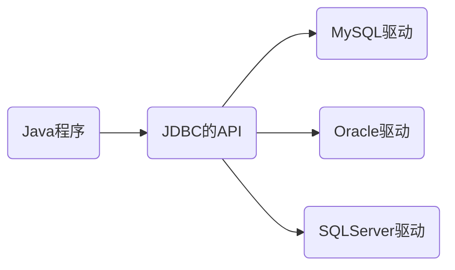

# JDBC

JDBC:Java Database Connectivity,独立于任何数据库,是Java提供的独立于任何数据库的API



## 基础连接

- 获取Driver对象,注册驱动

```java
Class.forName("com.mysql.cj.jdbc.Driver");
```

- 获取连接对象

```java
String url = "jdbc:mysql://localhost:3306/world";
String user = "root";
String password = "1234";

DriverManager.getConnection(url,user,password);
```

- 获取执行SQL语句的对象

```java
Statement statement = connection.createStatement();
```

- 编写并执行SQL语句

```java
String sql = "SELECT Code,Name FROM country;";
ResultSet resultSet = statement.executeQuery(sql);
```

- 处理结果

```java
while (resultSet.next()) {
    String Code = resultSet.getString("Code");
    String Name = resultSet.getString("Name");
    System.out.println(Code + "\t" + Name + "\t");
}
```

- 释放资源

```java
resultSet.close();
statement.close();
connection.close();
```

## 核心API

### 注册驱动

- 使用类加载和注册的方式加载对应数据库的驱动程序

```java
Class.forName("com.mysql.cj.jdbc.Driver");
DriverManager.registerDriver(new Driver());
```

>在jdk6以后Java会自动识别java.sql.Driver接口是否实现然后自动注册驱动程序,所以上述代码均可不写

### Connection

- 用于建立客户端和数据库的连接
- 需要指定URL,用户名,密码
- 也用于管理事务,可以使用commit()和rollback()方法操作
- 可以创建Statement对象与数据库进行操作
- 使用JDBC时需先创立Connection对象,**使用完毕后要释放资源**

### Statement

- 用于与数据库进行交互,并且执行语句
- 结果是一个或者多个结果
  - 一个:增删改操作
  - 多个:查询操作
- 一般不用,容易被SQL注入

### PrepareStatement

- Statement的子接口,用于预编译SQL命令
  - 创建PrepareStatement对象时就会预编译好SQL命令
  - 支持参数化查询,防止SQL注入
  - 性能提升

流程:

- 从Connection获取PrepareStatement对象(注意不能无参构造)
- 参数用?占位符

```java
String sql = "SELECT Name FROM country WHERE id = ?";
PrepareStatement preparedStatement = connection.prepareStatement(sql);
```

- 为占位符赋值(int 参数位置,String 参数)

```java
preparedStatement.setString(1,"China");
```

- 执行语句

```java
ResultSet resultSet = preparedStatement.executeQuery();
```

#### PrepareStatement执行更新语句

```java
String sql = "INSERT INTO mytable VALUES (?,?)";
PreparedStatement preparedStatement = connection.prepareStatement(sql);

preparedStatement.setInt(1,1);
preparedStatement.setString(2,"王");

int result = preparedStatement.executeUpdate();
```

>执行更新语句返回的是受影响的行数,int型

### ResultSet

- 只代表查询语句返回的结果
- 用next()判断结果集中还有没有下一行
- 用get数据类型查找数据

## 使用Hamcrest和Junit包进行调试

使用@Test对方法进行注解即可调试

## 常见报错

- SQLSyntaxErrorException:SQL语句语法错误/数据库名称错误
- SQLException
  - No value:未设置占位符
  - Access denied:账号密码错误
  - CommunicationException:通信异常

## 实体类和ORM

### 实体类

- 对于面向对象的Java而言,数据都是零散的不方便管理,此时需要一个类作为表的载体,一行数据对应Java中的一个对象,一个列对应一个属性

>对象类一般放在POJO包里面

#### 实体类初始化

- 创建对象
- 初始化属性(满足驼峰)
- 定义构造器(无参与有参)
- 定义set/get方法
- 定义toString方法

### ORM思想

- ORM思想(Object Relation Mapping):对象到数据库的映射,以面向对象的思想操作数据库
- ORM框架:MyBatis,JPA

在返回结果集时使用映射类

- 封装单个对象

```java
MyTable myTable = null; //若返回集有内容才创建对象
while (resultSet.next()) {
    int anInt = resultSet.getInt("id");
    String lastName = resultSet.getString("last_name");
    myTable = new MyTable(anInt, lastName);
    System.out.println(myTable);
}
```

>输出toString的值

- 封装集合

```java
List<MyTable> myTablesList = new ArrayList<>();

MyTable myTable = null;
while (resultSet.next()) {
    int anInt = resultSet.getInt("id");
    String lastName = resultSet.getString("last_name");

    myTable = new MyTable(anInt, lastName);

    myTablesList.add(myTable);
}

for (MyTable table : myTablesList) {
    System.out.println(table);
}
```

## 主键回显

- 用刚刚新增的数据作为我后续修改的条件
- 在Java程序中获取数据库中新插入的数据的主键值并赋值给Java对象,此操作称为主键回显

```java
String sql = "INSERT INTO mytable(last_name) VALUES(?)";
PreparedStatement preparedStatement = connection.prepareStatement(sql,Statement.RETURN_GENERATED_KEYS);

MyTable myTable = new MyTable(0,"刘");

preparedStatement.setString(1,myTable.getLastName());

int i = preparedStatement.executeUpdate();

if (i > 0) {
    ResultSet generatedKeys = preparedStatement.getGeneratedKeys();

    if (generatedKeys.next()) {
        int anInt = generatedKeys.getInt(1);

        System.out.println(anInt); //返回3
    }
}
```
