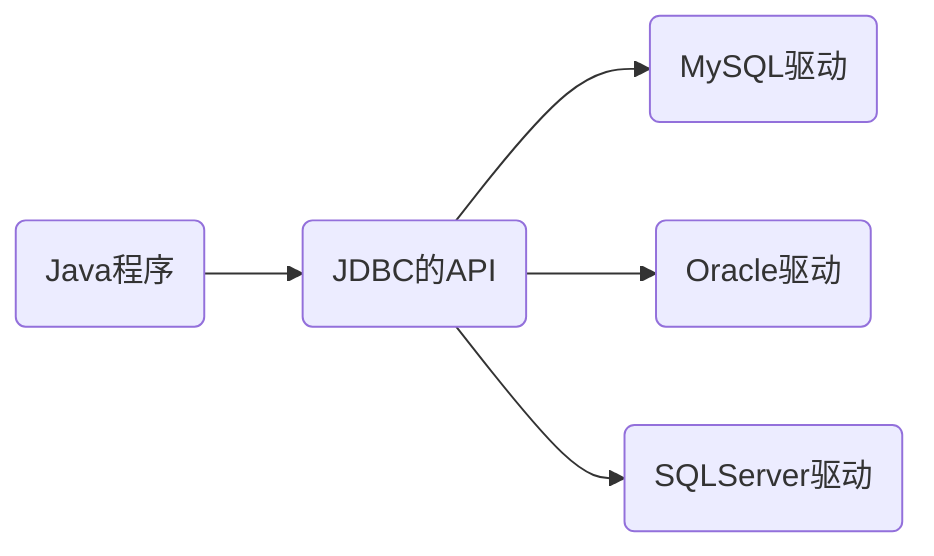

# JDBC

JDBC:Java Database Connectivity,独立于任何数据库,是Java提供的独立于任何数据库的API



## 基础连接

- 获取Driver对象,注册驱动

```java
Class.forName("com.mysql.cj.jdbc.Driver");
```

- 获取连接对象

```java
String url = "jdbc:mysql://localhost:3306/world";
String user = "root";
String password = "1234";

Connection connection = DriverManager.getConnection(url,user,password);
```

- 获取执行SQL语句的对象

```java
Statement statement = connection.createStatement();
```

- 编写并执行SQL语句

```java
String sql = "SELECT Code,Name FROM country;";
ResultSet resultSet = statement.executeQuery(sql);
```

- 处理结果

```java
while (resultSet.next()) {
    String Code = resultSet.getString("Code");
    String Name = resultSet.getString("Name");
    System.out.println(Code + "\t" + Name + "\t");
}
```

- 释放资源

```java
resultSet.close();
statement.close();
connection.close();
```

## 核心API

### 注册驱动

- 使用类加载和注册的方式加载对应数据库的驱动程序

```java
Class.forName("com.mysql.cj.jdbc.Driver");
DriverManager.registerDriver(new Driver());
```

>在jdk6以后Java会自动识别java.sql.Driver接口是否实现然后自动注册驱动程序,所以上述代码均可不写

### Connection

- 用于建立客户端和数据库的连接
- 需要指定URL,用户名,密码
- 也用于管理事务,可以使用commit()和rollback()方法操作
- 可以创建Statement对象与数据库进行操作
- 使用JDBC时需先创立Connection对象,**使用完毕后要释放资源**

### Statement

- 用于与数据库进行交互,并且执行语句
- 结果是一个或者多个结果
  - 一个:增删改操作
  - 多个:查询操作
- 一般不用,容易被SQL注入

### PrepareStatement

- Statement的子接口,用于预编译SQL命令
  - 创建PrepareStatement对象时就会预编译好SQL命令
  - 支持参数化查询,防止SQL注入
  - 性能提升

流程:

- 从Connection获取PrepareStatement对象(注意不能无参构造)
- 参数用?占位符

```java
String sql = "SELECT Name FROM country WHERE id = ?";
PrepareStatement preparedStatement = connection.prepareStatement(sql);
```

- 为占位符赋值(int 参数位置,String 参数)

```java
preparedStatement.setString(1,"China");
```

- 执行语句

```java
ResultSet resultSet = preparedStatement.executeQuery();
```

#### PrepareStatement执行更新语句

```java
String sql = "INSERT INTO mytable VALUES (?,?)";
PreparedStatement preparedStatement = connection.prepareStatement(sql);

preparedStatement.setInt(1,1);
preparedStatement.setString(2,"王");

int result = preparedStatement.executeUpdate();
```

>执行更新语句返回的是受影响的行数,int型

### ResultSet

- 只代表查询语句返回的结果
- 用next()判断结果集中还有没有下一行
- 用get数据类型查找数据

## 使用Hamcrest和Junit包进行调试

使用@Test对方法进行注解即可调试

## 常见报错

- SQLSyntaxErrorException:SQL语句语法错误/数据库名称错误
- SQLException
  - No value:未设置占位符
  - Access denied:账号密码错误
  - CommunicationException:通信异常

## 实体类和ORM

### 实体类

- 对于面向对象的Java而言,数据都是零散的不方便管理,此时需要一个类作为表的载体,一行数据对应Java中的一个对象,一个列对应一个属性

>对象类一般放在POJO包里面

#### 实体类初始化

- 创建对象
- 初始化属性(满足驼峰)
- 定义构造器(无参与有参)
- 定义set/get方法
- 定义toString方法

### ORM思想

- ORM思想(Object Relation Mapping):对象到数据库的映射,以面向对象的思想操作数据库
- ORM框架:MyBatis,JPA

在返回结果集时使用映射类

- 封装单个对象

```java
MyTable myTable = null; //若返回集有内容才创建对象
while (resultSet.next()) {
    int anInt = resultSet.getInt("id");
    String lastName = resultSet.getString("last_name");
    myTable = new MyTable(anInt, lastName);
    System.out.println(myTable);
}
```

>输出toString的值

- 封装集合

```java
List<MyTable> myTablesList = new ArrayList<>();

MyTable myTable = null;
while (resultSet.next()) {
    int anInt = resultSet.getInt("id");
    String lastName = resultSet.getString("last_name");

    myTable = new MyTable(anInt, lastName);

    myTablesList.add(myTable);
}

for (MyTable table : myTablesList) {
    System.out.println(table);
}
```

## 主键回显

- 用刚刚新增的数据作为我后续修改的条件
- 在Java程序中获取数据库中新插入的数据的主键值并赋值给Java对象,此操作称为主键回显

```java
String sql = "INSERT INTO mytable(last_name) VALUES(?)";
PreparedStatement preparedStatement = connection.prepareStatement(sql,Statement.RETURN_GENERATED_KEYS);

MyTable myTable = new MyTable(0,"刘");

preparedStatement.setString(1,myTable.getLastName());

int i = preparedStatement.executeUpdate();

if (i > 0) {
    ResultSet generatedKeys = preparedStatement.getGeneratedKeys();

    if (generatedKeys.next()) {
        int anInt = generatedKeys.getInt(1);

        System.out.println(anInt); //返回3
    }
}
```

## 批量操作

批量从MySQL中插入数据

- 先在连接中设置可以批量操作

```java
Connection connection = DriverManager.getConnection("jdbc:mysql:///mydb?rewriteBatchedStatements = true",user,password);
```

- 再设置代码

```java
preparedStatement.addBatch();

prepareStatement.executeBatch();
```

## 连接池

- 现有问题
  - 每次创建链接都要创造和销毁对象
  - 连接的数量无法把控

- 解决方法:连接池
  - 数据库连接对象的缓存池
  - 预先创建数据库连接并放入对象,当用户获取连接时从连接池中取出对象,用完再放回去
  - 当连接池过多人时,会按照要求增加对象
  - 连接池中达到上限,会延缓请求时间

- 常见连接池
  - Druid(稳定性和兼容性好)
  - Hikari(速度巨快,效率极高)

- 不同编码
  - 硬编码
    - 将配置和Java代码耦合在一起
  - 软编码(推荐)
    - 将配置单独放在一个配置文件中

### Druid软编码实现连接

- 创建Properties集合

```java
Properties properties = new Properties();
```

- 读取外部文件,获取输入流,加载到Properties集合里

```properties
driverClassName=com.mysql.cj.jdbc.Driver
url=jdbc:mysql:///mydb
username=root
password=1234
initialSize=10
maxActive=20
```

```java
InputStream resourceAsStream = JDBC.class.getClassLoader().getResourceAsStream("database.properties");
properties.load(resourceAsStream);
```

- 获取Druid连接池

```java
DataSource dataSource = DruidDataSourceFactory.createDataSource(properties);
```

- 获取连接

```java
Connection connection = dataSource.getConnection();
```

- CRUD编写

- 返回对象

```java
conncetion.close();
```

### Hikari软编码实现连接

- 获取配置文件和上述相同

- 获取Hikari连接池

```java
HikariConfig hikariConfig = new HikariConfig(properties); //这里的配置文件和上面不一样要按照hikari的格式

HikariDataSource hikariDataSource = new HikariDataSource(hikariConfig);
```

- 获取连接

```java
Connection connection = hikariDataSource.getConnection();
```

## 封装JDBC工具类

将编码编写成一个类以供调用

```java
package utils;

import com.alibaba.druid.pool.DruidDataSourceFactory;

import javax.sql.DataSource;
import java.io.InputStream;
import java.sql.Connection;
import java.sql.SQLException;
import java.util.Properties;

public class JDBCUtil {
    private static final DataSource dataSource;

    static {
        Properties properties = new Properties();
        InputStream databasesConfig = JDBCUtil.class.getClassLoader().getResourceAsStream("database.properties");
        try {
            properties.load(databasesConfig);
            dataSource = DruidDataSourceFactory.createDataSource(properties);
        } catch (Exception e) {
            throw new RuntimeException(e);
        }
    }

    public static Connection getConnection() throws SQLException {
        return dataSource.getConnection();
    }

    public static void release(Connection connection) throws SQLException {
        connection.close();
    }
}
```

## **ThreadLocal**

- 当有多次连接时多个请求有可能拿到同一个connection对象,此时ThreadA和ThreadB都会对connection进行修改造成bug,于是ThreadLocal就可以保护线程

- ThreadLocal用于保存各个线程的私有变量,原因是每个Thread对象内部都有一个ThreadLocalMap,以ThreadLocal对象为key,存储属于当前线程的变量副本
  - 为了一个线程在多次使用数据库的时候使用的是同一个连接
  - 在进行对象跨层传递时,使用ThreadLocal可以避免多次传递
  - 线程间数据隔离

```java
package utils;

import com.alibaba.druid.pool.DruidDataSourceFactory;

import javax.sql.DataSource;
import java.io.InputStream;
import java.sql.Connection;
import java.sql.SQLException;
import java.util.Properties;

public class JDBCUtil {
    private static final DataSource dataSource;
    private static final ThreadLocal<Connection> threadLocal = new ThreadLocal<>();

    static {
        Properties properties = new Properties();
        InputStream databasesConfig = JDBCUtil.class.getClassLoader().getResourceAsStream("database.properties");
        try {
            properties.load(databasesConfig);
            dataSource = DruidDataSourceFactory.createDataSource(properties);
        } catch (Exception e) {
            throw new RuntimeException(e);
        }
    }

    public static Connection getConnection() throws SQLException {
        Connection connection = threadLocal.get(); //从线程背包中取出

        if (connection == null) { //如果是第一次连接
            connection = dataSource.getConnection(); //获取连接
            threadLocal.set(connection); //在线程背包中设置连接
        }
        return connection;
    }

    public static void release() throws SQLException {
        Connection connection = threadLocal.get(); //从线程背包中获取连接,这样就不必传递一个connection

        if (connection != null) { //如果线程背包中有这个连接
            threadLocal.remove(); //从线程背包中移除
            connection.close();
        }
    }
}
```

## DAO层

- DAO(Data Access Object):Java中数据一般是以对象形式出现,一张表代表一个对象,一张表的操作对应的是DAO对象,在Java操作数据库时一般将同一张表的CRUD操作统一维护起来,维护的这个类就是DAO层,维护的方法供业务层操作

- 表DAO:通常先写一个接口对应某张表的CRUD操作
  - 表DAOImpl:实现某个表的接口

- BaseDAO:将重复的执行过程封装成一个方法然后供其他DAO调用

```java
package model.DAO;

import model.POJO.MyTable;

import java.util.List;

/**
 * @author Mel0ny
 * @date 2025/12/19  20:47
 * @description MyTable这张表的数据操作接口
 */
public interface MyTableDAO {

    /**
     * 查询所有的数据
     *
     * @return 所有的数据
     */
    List<MyTable> selectAllData();

    /**
     * 通过id查询数据
     *
     * @return 特定的数据
     */
    MyTable selectById();
}
```

### BASEDAO

- 查询有三种情况:多行多列(List\<T>)、单列多行(T)、单列单行。需要查询的表格也不同,返回的类型也不同,若要建立一个通用的查询就需要用到泛型,还需要通过反射获取传入类的私有属性

ResultSetMetaData:结果集中的元数据集,包含了列的数量,名称

```java
package model.DAO;

import utils.JDBCUtil;

import java.lang.reflect.Field;
import java.lang.reflect.InvocationTargetException;
import java.sql.*;
import java.util.ArrayList;
import java.util.List;

/**
 * @author Mel0ny
 * @date 2025/12/19  20:52
 * @description 基础的CRUD操作
 */
public class BaseDAO {

    /**
     * Execute update int.
     *
     * @param sql    需要执行的增删改SQL语句
     * @param params 占位符的参数
     * @return 受影响的行数
     * @throws SQLException the sql exception
     */
    public static int executeUpdate(String sql,Object...params) throws SQLException {
        Connection connection = JDBCUtil.getConnection();

        PreparedStatement preparedStatement = connection.prepareStatement(sql);

        if (params != null) {
            for (int i = 0; i < params.length; i++) {
                preparedStatement.setObject(i + 1,params[i]);
            }
        }

        int i = preparedStatement.executeUpdate();

        System.out.println(i + "行收到了影响");

        preparedStatement.close();
        JDBCUtil.release();

        return i;
    }

    /**
     * 获取多行多列数据
     *
     * @param <T>    表对象
     * @param clazz  t表对象
     * @param sql    需要执行的SQL语句
     * @param params 查询参数
     * @return 结果集对象形成的集合
     * @throws Exception the exception
     */
    public static <T> List<T> executeQuery(Class<T> clazz,String sql,Object...params) throws Exception {
        //获取连接
        Connection connection = JDBCUtil.getConnection();

        //预编译语句
        PreparedStatement preparedStatement = connection.prepareStatement(sql);

        //设置参数值
        if (params != null && params.length > 0) {
            for (int i = 1; i <= params.length; i++) {
                preparedStatement.setObject(i,params[i - 1]);
            }
        }

        //结果集
        ResultSet resultSet = preparedStatement.executeQuery();
        //用来获取结果集类型和属性对象的对象
        ResultSetMetaData metaData = resultSet.getMetaData();

        //字段的数量
        int columnCount = metaData.getColumnCount();

        //容纳结果的集合
        List<T> list = new ArrayList<>();

        //while判断,当结果集还有下一行时,执行下面的语句
        while (resultSet.next()) {
            //每一列代表一个对象,指针移到下一列就创造一个对象
            T t = clazz.getDeclaredConstructor().newInstance();

            /*
            获取每一列的字段,例:
            id          last_name
            1             张三
            此时列表循环两次,再通过反射获取POJO的属性,例如
            private int id;
            private String lastname;
            将私有属性设置为可通过
            将值赋给对应的属性
             */
            for (int i = 1; i <= columnCount; i++) {
                //获取列值
                Object value = resultSet.getObject(i);

                //获取列名
                String columnName = metaData.getColumnLabel(i);

                //通过反射获取到对应对象的属性并设置为可访问
                Field declaredField = clazz.getDeclaredField(columnName);
                declaredField.setAccessible(true);

                //将值赋给对应的对象
                declaredField.set(t,value);
            }

            //将赋值好的对象加入到集合当中
            list.add(t);
        }
        //释放资源
        resultSet.close();
        preparedStatement.close();
        JDBCUtil.release();

        //返回值
        return list;
    }

    /**
     * 查询单个结果
     *
     * @param <T>    表对象
     * @param clazz  表对象类型
     * @param sql    需要执行的SQL语句
     * @param params 查询参数
     * @return 单条结果
     * @throws Exception the exception
     */
    public <T> T executeQueryBean (Class<T> clazz,String sql,Object params) throws Exception {
        List<T> list = this.executeQuery(clazz, sql, params);
        if (list == null || list.size() == 0) {
            return null;
        }
        return list.getFirst();
    }
}
```

## 事务

- SQL语句的缓存机制,根据多条语句的结果来执行数据库数据的修改,可以用commit提交事务,可以用rollback回滚事务

- 事务的特性:
  1. `原子性` (`Atomicity`): 原子性是指事务是一个不可分割的工作单位, 事务中的操作要么都发生, 要么都不发生。

  2. `一致性` (`Consistency`): 事务必须使数据库从一个一致性状态变换到另外一个一致性状态。

  3. `隔离性` (`Isolation`): 事务的隔离性是指一个事务的执行不能被其他事务干扰, 即一个事务内部的操作及使用的数据对并发的其他事务是隔离的, 并发执行的各个事务之间不能互相干扰。

  4. `持久性` (`Durability`): 持久性是指一个事务一旦被提交, 它对数据库中数据的改变就是永久性的, 接下来 的其他操作和数据库故障不应该对其有任何影响。
