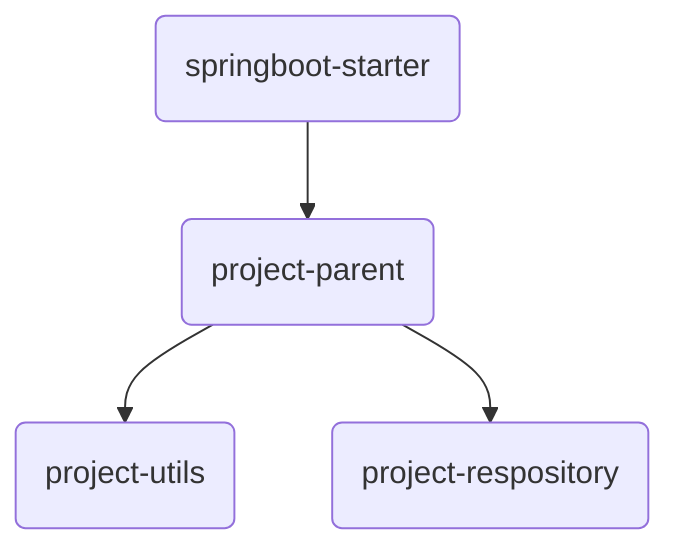

# Maven

- pom.xml中的配置
  - \<groupId>:隶属组织名称,一般是域名反写
  - \<artifactid>:当前项目目录名称
  - \<version>:当前项目版本号
  - \<scope>:用来控制依赖的范围

开发项目需提前设计项目结构,使用Maven分模块设计,方便维护和管理

## 继承

在项目中指定父项目,其他项目继承父项目,其依赖便可继承

可在父项目配置中指定版本号锁定依赖版本
