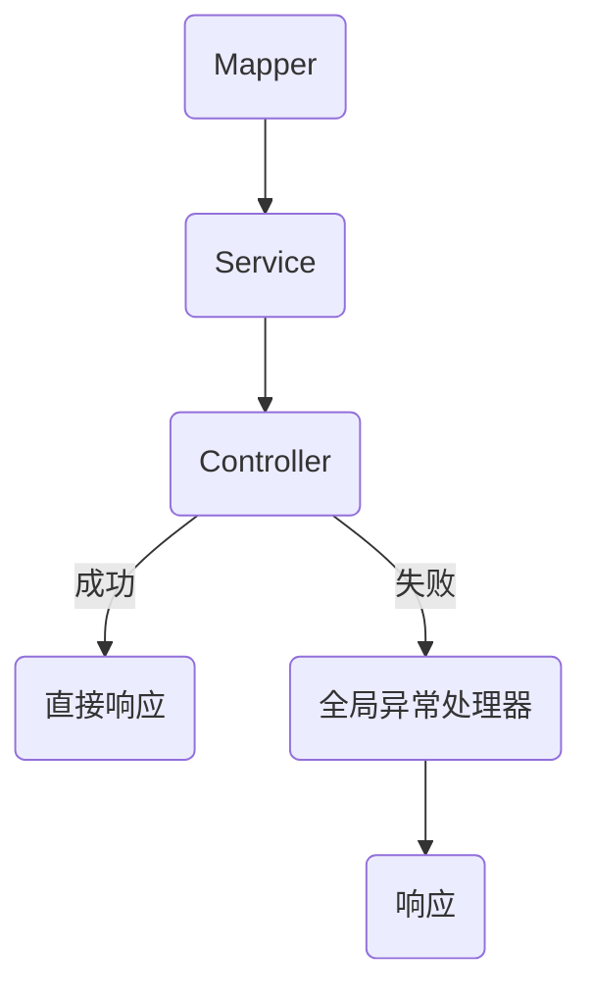
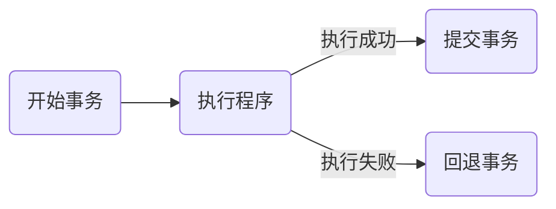

# 项目开发中的细节

## Restful接口建议规范

### REST风格

```html
https://localhost:8080/api/users/1 GET请求:查询id为1的用户信息
https://localhost:8080/api/users POST请求:新增用户
https://localhost:8080/api/users PUT请求:修改用户
https://localhost:8080/api/users/1 DELETE:删除id为1的用户信息
```

- GET:使用@GetMapping(url)注解
- POST:使用@PostMapping(url)注解
- PUT:使用@PutMapping(url)注解
- DELTE:使用@DeleteMapping(url)注解

### 响应状态

- Result.java

```java
package com.mel0ny.springboot.pojo;

import lombok.AllArgsConstructor;
import lombok.Data;
import lombok.NoArgsConstructor;

@Data
@AllArgsConstructor
@NoArgsConstructor
public class Result {
    private Integer id;
    private String msg;
    private Object data;

    public static Result success() {
        return new Result(1,"success",null);
    }

    public static Result success(Object data){
        return new Result(1,"success",data);
    }

    public static Result success(String msg,Object data) {
        return new Result(1,msg,data);
    }

    public static Result error() {
        return new Result(0,"error",null);
    }

    public static Result error(Object data){
        return new Result(0,"error",data);
    }

    public static Result error(String msg,Object data) {
        return new Result(0,msg,data);
    }
}
```

### 接口文档

接口文档

- xxx功能接口
  - 基本信息
    - 请求路径
    - 请求方式
    - 接口描述
  - 请求参数
  - 响应参数
    - 参数格式
    - 参数说明
    - 响应数据样例

## 记录日志

- 在类上使用@Slf4j注解即可使用log对象记录日志

```java
@Slf4j
@RestController
public class TestController {
    //相当于private static Logger logger = LoggerFactory.getLogger(TestController.class);
}
```

### Mybatis日志

- application.yaml

```yaml
mybatis:
  configuration:
    map-underscore-to-camel-case: true
```

### SpringBoot事务日志

- application.yaml

```yaml
logging:
  level:
    org.springframework.jdbc.support.JdbcTransactionManager: debug
```

## 外部配置的属性注入

在properties中均为key:value的形式,可在springboot中使用注解注入参数

@Value("${key}"):注入单个属性

```java
@Value("${spring.user.password}")
private String password;
```

@ConfigurationProperties(prefix = "mybatis.configuration"):注入批量属性

```java
@ConfigurationProperties(prefix = "")
public interface UserMapper {
}
```

## YAML/YML格式

- application.properties

```properties
spring.application.name=SpringBoot
spring.datasource.driver-class-name=com.mysql.cj.jdbc.Driver
spring.datasource.url=jdbc:mysql://localhost:3306/mybatis
spring.datasource.username=root
spring.datasource.password=1234
```

- application.yaml

```yaml
spring:
  application:
    name: SpringBoot
  datasource:
    driver-class-name: com.mysql.cj.jdbc.Driver
    url: jdbc:mysql://localhost:3306/mybatis
    username: root
    password: 1234
```

伪代码:

```yaml
分级1:
(空两格)分级二:
       key:(空一格)value
       同级配置:(空一格)缩进要相同
```

## 异常处理

>出现异常时后端返回的JSON数据不符合开发规范(status:500),于是需要异常处理

- 处理方案:
  - 在每一个Controller中加上try-catch(不推荐)
  - 全局异常处理器(捕获全局异常)



```java
@RestControllerAdvice
public class GobalExceptionHandler {

    @ExceptionHandler(Exception.class) //需要捕获的异常
    public Result exceptionHandler(Exception exception) {
        exception.printStackTrace();
        return Result.error("发生错误"); //返回前端可以接受处理的格式
    }
}
```

## 事务管理

当一个操作中间包含多个操作时,若其中一个操作出现异常,则后面的操作都不会执行,前面的操作会继续执行,会造成数据的不完整,此时便需要事务



- @Transactional注解
  - 放在业务层的方法,类,接口上(将多个数据的处理程序放在一个事务内)
  - 自动实现事务
  - 一般在CRUD方法上加

### Transactional详解

- rollbackFor
  - 默认情况下只有出现RuntimeException才回滚异常
  - rollbackFor用于控制出现何种异常类型回滚事务

```java
@Transactional(rollbackFor = Exception.class) //回滚所有异常
```

- propagation
  - 事务的传播行为,当一个事务被另一个事务调用时,这个事务方法该怎么控制
  - 可通过propagation属性调整传播行为

| 传播行为 | 对应常量值 | 含义说明 |
| :---: | :---: | :---: |
| **REQUIRED** | `TransactionDefinition.PROPAGATION_REQUIRED` | **默认设置**。支持当前事务，如果没有则创建新事务。 |
| **SUPPORTS** | `TransactionDefinition.PROPAGATION_SUPPORTS` | 支持当前事务，如果没有则以非事务方式执行。 |
| **MANDATORY** | `TransactionDefinition.PROPAGATION_MANDATORY` | 支持当前事务，如果没有则抛出异常。 |
| **REQUIRES_NEW** | `TransactionDefinition.PROPAGATION_REQUIRES_NEW` | 创建新事务，如果当前存在事务则挂起当前事务。 |
| **NOT_SUPPORTED** | `TransactionDefinition.PROPAGATION_NOT_SUPPORTED` | 以非事务方式执行，如果当前存在事务则挂起当前事务。 |
| **NEVER** | `TransactionDefinition.PROPAGATION_NEVER` | 以非事务方式执行，如果当前存在事务则抛出异常。 |
| **NESTED** | `TransactionDefinition.PROPAGATION_NESTED` | 如果当前存在事务则在嵌套事务内执行，否则行为类似 REQUIRED。 |
