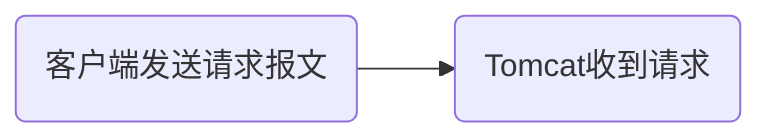
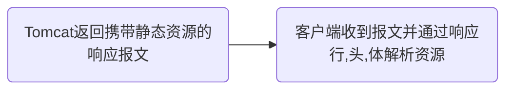
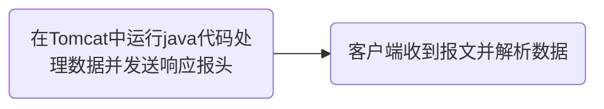
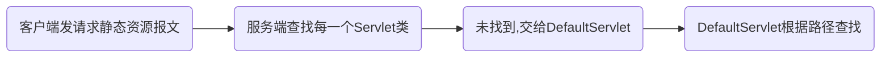
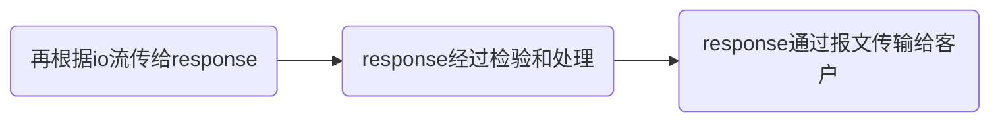

# Servlet技术

- 能处理客户端请求并做出响应的一套技术标准
- 只能在Tomcat这样的网站容器中才能运行

## 静态资源和动态资源

静态资源:`html``css``js`等,不需要通过代码生成(不是网页画面的动态)

动态资源:`Servlet``Thtmeleaf`等,需要通过代码生成

获取静态资源:





获取动态资源:




## 后端收到动态资源流程

\[
客户端发送请求报文 \rightarrow Tomcat收到请求后将报文转换成一个HttpServletRequest对象 \rightarrow \\
Tomcat同时创建一个HttpServletResponse对象 \rightarrow Tomcat根据请求行获得路径,实例化servlet并将两个对象传入
\]

\[
在servlet对象中,通过HttpServletRequest获得数据并处理数据 \rightarrow 将处理好的数据放入response对象中
\]

## Content-Type响应头

MINE类型响应头(媒体类型,文件类型)
用来告诉客户端响应的是什么类型的数据,客户端以此用不同的方式解析资源

当客户端请求文件时,Tomcat会去特定位置查找文件,并在web.xml中查找相对应格式的Content-Type值并赋给响应头中的Content-Type

```java
request.getParameter("参数名"); //根据参数值获取参数名
response.setHeader("Content-Type","text/html")； //设置响应头的MINE类型
```

## Servlet生命周期

生命周期:对象在容器从开始到销毁的过程

Servlet生命周期流程图


当客户端访问对应的Servlet对象时,先执行构造器,再初始化,后面无论访问多少次都是执行服务方法,当服务端关机时执行销毁方法

>**不能**在服务方法中修改成员变量,会出现线程安全问题(并发)

在启动Tomcat的时候自动实例化Servlet对象:

- 方法一:修改@WebServlet值

```java
@WebServlet(value = "path",loadOnStartup = 正整数(启动顺序))
```

- 方法二:修改web.xml

```xml
<load-on-startup>正整数(0-5已被Tomcat占用)<load-on-startup>
```

### Default-Servlet

对应的资源:除jsp之外的所有资源

当客户端发出请求头查找静态资源后,会自动和每一个servlet对象比对,找不到则去DefaultServlet类中根据路径找相对应的静态文件,然后通过io流将文件传输到DefaultServlet类中的response中,经过各种检查再以报文的方式传输给客户端

流程图:





>若再SpringMVC中不对其进行配置则访问静态资源时极有可能会402
