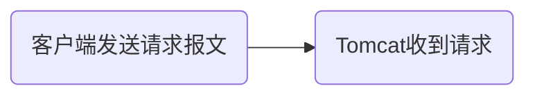
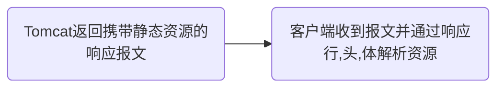
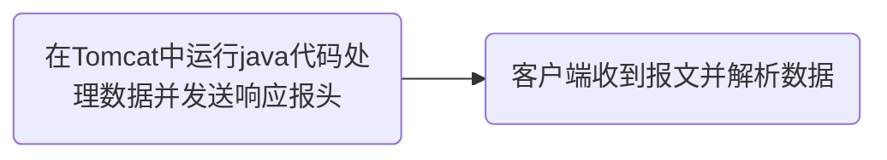
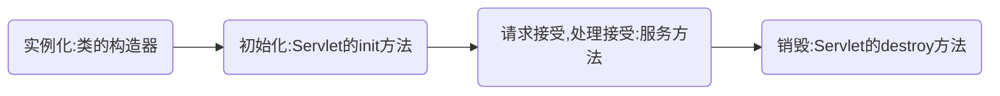
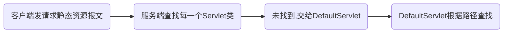
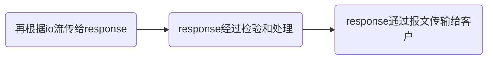
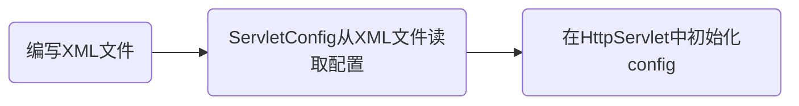
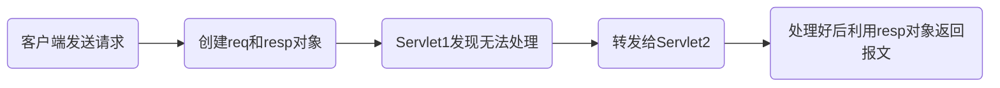
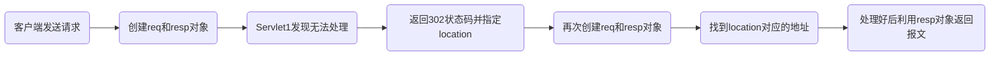

# Servlet技术

- 能处理客户端请求并做出响应的一套技术标准
- 只能在Tomcat这样的网站容器中才能运行

## 静态资源和动态资源

静态资源:`html css js`等,不需要通过代码生成(不是网页画面的动态)

动态资源:`Servlet Thyxmeleaf`等,需要通过代码生成

获取静态资源:





获取动态资源:




## 后端收到动态资源流程

\[
客户端发送请求报文 \rightarrow Tomcat收到请求后将报文转换成一个HttpServletRequest对象 \rightarrow \\
Tomcat同时创建一个HttpServletResponse对象 \rightarrow Tomcat根据请求行获得路径,实例化servlet并将两个对象传入
\]

\[
在servlet对象中,通过HttpServletRequest获得数据并处理数据 \rightarrow 将处理好的数据放入response对象中
\]

## Content-Type响应头

MINE类型响应头(媒体类型,文件类型)
用来告诉客户端响应的是什么类型的数据,客户端以此用不同的方式解析资源

当客户端请求文件时,Tomcat会去特定位置查找文件,并在web.xml中查找相对应格式的Content-Type值并赋给响应头中的Content-Type

```java
request.getParameter("参数名"); //根据参数值获取参数名
response.setHeader("Content-Type","text/html")； //设置响应头的MINE类型
```

## Servlet生命周期

生命周期:对象在容器从开始到销毁的过程

Servlet生命周期流程图



当客户端访问对应的Servlet对象时,先执行构造器,再初始化,后面无论访问多少次都是执行服务方法,当服务端关机时执行销毁方法

>**不能**在服务方法中修改成员变量,会出现线程安全问题(并发)

在启动Tomcat的时候自动实例化Servlet对象:

- 方法一:修改@WebServlet值

```java
@WebServlet(value = "path",loadOnStartup = 正整数(启动顺序))
```

- 方法二:修改web.xml

```xml
<load-on-startup>正整数(0-5已被Tomcat占用)<load-on-startup>
```

### Default-Servlet

对应的资源:除jsp之外的所有资源

当客户端发出请求头查找静态资源后,会自动和每一个servlet对象比对,找不到则去DefaultServlet类中根据路径找相对应的静态文件,然后通过io流将文件传输到DefaultServlet类中的response中,经过各种检查再以报文的方式传输给客户端

流程图:





>若再SpringMVC中不对其进行配置则访问静态资源时极有可能会402

## Servlet继承结构

### Servlet接口

```java
//初始化Servlet类
void init(ServletConfig config) throws ServletException;

//加载Servlet配置
ServletConfig getServletConfig();

//处理服务
void service(ServletRequest req, ServletResponse res) throws ServletException, IOException;

//获得状态
String getServletInfo();

//释放资源
void destroy();
```

### GenericServlet抽象类

```java
@Override
    public void init(ServletConfig config) throws ServletException {
        this.config = config;
        this.init();
    }
    //初始化方法,不重写上面的方法就可以免于对ServletConfig进行配置
    public void init() throws ServletException {
        // NOOP by default
    }
    
```

### HttpServlet抽象类

HttpServlet侧重于service()方法处理

```java
protected void service(HttpServletRequest req, HttpServletResponse resp) throws ServletException, IOException {

        String method = req.getMethod();

        switch (method) {
            ...
        }
}
```

在HttpServlet类中的service方法会处理各种各样的请求并故意返回405状态码

我们重写业务的时候尽量重写doGET、doPOST方法等避免破坏逻辑

注释:

```java
/**
 * Provides an abstract class to be subclassed to create an HTTP servlet suitable for a website. A subclass of
 * <code>HttpServlet</code> must override at least one method, usually one of these:
 * <ul>
 * <li><code>doGet</code>, if the servlet supports HTTP GET requests
 * <li><code>doPost</code>, for HTTP POST requests
 * <li><code>doPut</code>, for HTTP PUT requests
 * <li><code>doDelete</code>, for HTTP DELETE requests
 * <li><code>init</code> and <code>destroy</code>, to manage resources that are held for the life of the servlet
 * <li><code>getServletInfo</code>, which the servlet uses to provide information about itself
 * </ul>
 * <p>
 * There's almost no reason to override the <code>service</code> method. <code>service</code> handles standard HTTP
 * requests by dispatching them to the handler methods for each HTTP request type (the <code>do</code><i>Method</i>
 * methods listed above).
 * <p>
 * Likewise, there's almost no reason to override the <code>doOptions</code> and <code>doTrace</code> methods.
 * <p>
 * Servlets typically run on multithreaded servers, so be aware that a servlet must handle concurrent requests and be
 * careful to synchronize access to shared resources. Shared resources include in-memory data such as instance or class
 * variables and external objects such as files, database connections, and network connections. See the
 * <a href="http://java.sun.com/Series/Tutorial/java/threads/multithreaded.html"> Java Tutorial on Multithreaded
 * Programming</a> for more information on handling multiple threads in a Java program.
 */
```

## ServletConfig和ServletContent

### ServletConfig使用



| 返回值类型 | 方法 | 功能描述 |
|:---:|:---|:---|
| `String` | `getInitParameter(String name)` | 根据初始化参数名 `name`，返回对应的初始化参数值。 |
| `Enumeration<String>` | `getInitParameterNames()` | 返回Servlet所有的初始化参数名的枚举集合，如果该Servlet没有初始化参数，则返回一个空的集合。 |
| `ServletContext` | `getServletContext()` | 返回一个代表当前Web应用的ServletContext对象。 |
| `String` | `getServletName()` | 返回Servlet的名字，即web.xml中`<servlet-name>`元素的值。 |

### ServletContext使用

ServletConfig每个Servlet对象都有,ServletContext每个Servlet对象都公用一个

相当于:

- ServletConfig:用户参数
- ServletContext:全局参数

获取项目部署位置的api

```java
String path = servletContext.getRealPath("文件夹");
```

获取项目上下文绝对路径的api

```java
String path = getServletContext().getContextPath();
```

#### 域对象

- 域对象:一些用于存储数据和传输数据的对象,传递数据不同的范围称为不同的域,不同的域对象代表不同的域,共享的数据范围

- ServletContext代表应用,所以ServletContext域也叫应用域,是webapp中最大的域,可以在本应用中传递数据
- webapp中的三大域分别是:应用域,会话域,请求域

三大域都有的api

|API|解释|
|:---:|:---:|
|`void setAttribute(String value,Object value);`|向域中存储/修改数据|
|`Object getAttribute(String value)`|获得域中数据|
|`void removeAttribute(String value)`|移除域中数据|

## HttpServletRequest

>接口,父接口为ServletRequest,Tomcat将请求报文封装成对象,在Tomcat调用service方法时传入,所有请求均可在该对象获得

常见api

- 请求行相关
  - `getMethod()`:请求方式(`GET/POST`)
  - `getScheme()`:请求协议(`http`)
  - `getProtocol()`:请求协议及版本(`HTTP/1.1`)
  - `getRequestURI()`:获取请求的uri(`/myweb/servlet1`)
  - `getRequestURL()`:获取请求的url(`https://localhost:8080/myweb/servlet1`)
  - `getLocalPort()`:获取本应用容器的端口号(8080)
  - `getSeverPort()`:获取客户端发请求的端口号(代理服务器端口)
  - `getRemotePort()`:获取远程客户端的端口号
- 请求头相关
  - `getHeader("Name")`:根据名字获取请求头
  - `getInputStream()`:获取输入流

## HttpServletResponse

>接口,父接口为ServletResponse,Tomcat提前创立,在Tomcat调用service方法时传入,将响应的报文传给客户端

常见api

- 响应行相关
  - `setStatus()`:设置响应码(202,404)
- 响应头相关
  - `setHeader()`:设置响应头的参数值("Content-Type","text/html")
  - `setContentType()`:设置响应数据类型("text/html")
  - `setContentLength()`:设置响应数据长度
  - `getOutputStream()`:获得输出流

## 请求转发

- 请求转发和响应重定向是web应用中间接访问项目资源的重要方式
- 请求转发由HttpServletRequest实现,响应重定向由HttpServletResponse实现

流程图:



```java
RequestDispatcher reqdispatcher = req.getRequestDispatcher("资源"); //获取转发器
reqdispatcher.forward(req,resp); //执行转发操作
```

- 客户端只发了一次请求
- 客户端的地址不变
- 目标资源可以是servlet动态资源也可以是静态资源(包括WEB/INF)
- 目标资源不能是外部资源
- 请求参数可以继续传递

## 响应重定向



```java
resp.sendRedirect("资源");
```

- 响应重定向是客户端在服务器提示下的行为
- 响应重定向客户端至少发送了两次请求
- 请求中的参数不能传递
- 重定向可以是静态资源
- 无法访问WEB-INF里的资源
- 可以重定向外部的资源

## 相对路径和绝对路径

- 相对路径
  - 相对于当前文件的位置
  - 不以`/`开头
  - 前一级别路径为`./`上一级路径为`../`
- 绝对路径(后端代码不用写上下文位置,以`/`开头即可)
  - 以`/`开头
  - 不依赖当前文件的位置
  - 不包括ip
