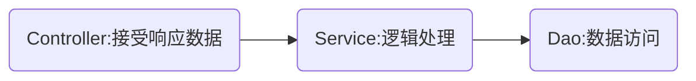
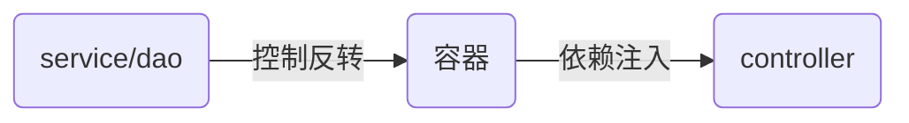

# SpringBoot框架

## 获取请求参数

### 简单参数

将参数名作为形参即可获取

请求链接为`http://localhost:8080/user?name=zhangsan&age=18`

>只需保证请求参数名称和形参名称相同即可,不相同不会报错但会返回null

```java
@RequestMapping("/user")
public String user(String name,Integer age) {
    return (name + "\t" + age);
}
```

- 获取简单参数
  - @RequestParams注解:可将参数名转化成别名
    - name:实际请求链接中的参数
    - **required**:是否必须,默认为true,若请求链接未带参数则返回400状态值

```java
@RequestMapping("/user")
public String helloWorld(@RequestParam(name = "name",required = false) String username, Integer age) {
    return (username + "\t" + age);
}
```

### 实体参数

若参数众多,不方便管理,此时就可将参数封装成实体(POJO)

- User.java

```java
@Data
public class User {
    private String name;
    private Integer age;
}
```

- Controller.java

```java
@RequestMapping("/pojo")
public String pojo(User user) {
    return user;
}
```

>参数可以嵌套,例如address.province和address.city

### 数组集合参数

>请求参数名和形参数组名相同且请求参数多个,定义数组类型形参即可接收参数

- 获取数组参数
  - 使用数组来作为形参

```java
@RequestMapping("/array")
public String array(String[] checkbox) {
    System.out.println(Array.toString(checkbox)); //输出[参数1,参数2...]
    return "OK"
}
```

- 获取集合参数
  - 集合一定要有@RequestParams修饰

```java
@RequestMapping("/list")
public String list(@RequestParams List<String> list) {
    System.out.println(list); //输出[参数1,参数2...]
    return "OK"
}
```

### 日期参数

- 获取日期参数
  - 使用@DateTimeFormat注解设置接收参数的格式
  - 使用LocalDateTime类设置参数

```java
@RequestMapping("/date")
public String date(@DateTimeFormat(pattern = "yyyy-MM-dd HH:mm:ss")LocalDateTime localDateTime) {
    return localDateTime.toString();
}
```

### JSON参数

在Postman中发送JSON参数需要使用post方式,并且使用raw的JSON格式

- 获取JSON数据
  - POJO类中的变量名必须和参数相同
  - 使用@RequestBody注解

```java
@RequestMapping("/json")
public String json(@RequestBody User user) {
    return user.toString;
}
```

### 路径参数

将路径作为参数,例:`http://localhost:8080/path/1/zhangsan`

```java
@RequestMapping("/path/{id}/{name}")
public String path(@PathVariable Integer id,@PathVariable String name) {
    return id + name;
}
```

## 设置响应参数

### @ResponseBody

- 类/方法注解
  - 放在Controller方法/类上
  - 将返回值直接响应,若返回值是对象或集合,则先转成JSON在相应
  - @RestController = @Controller + @ResponseBody

### 响应格式

- 响应的返回值各种各样不方便前端对其进行解析,此时就需要一个统一的返回格式

- Result.java

```java
package com.mel0ny.springboot.pojo;

import lombok.AllArgsConstructor;
import lombok.Data;
import lombok.NoArgsConstructor;

@Data
@AllArgsConstructor
@NoArgsConstructor
public class Result {
    private Integer id;
    private String msg;
    private Object data;

    public static Result success() {
        return new Result(1,"success",null);
    }

    public static Result success(Object data){
        return new Result(1,"success",data);
    }

    public static Result success(String msg,Object data) {
        return new Result(1,msg,data);
    }

    public static Result error() {
        return new Result(0,"error",null);
    }

    public static Result error(Object data){
        return new Result(0,"error",data);
    }

    public static Result error(String msg,Object data) {
        return new Result(0,msg,data);
    }
}
```

- Controller.java

```java
@RequestMapping("/path/{id}/{name}")
public Result path(@PathVariable Integer id, @PathVariable String name) {
    return Result.success("id="+ id + " name=" + name);
}
```

## 分层解耦

为了保证项目维护起来更容易,代码复用率更高,通常遵循单一职责原则

- 单一职责原则的不同层次:
  - 数据访问
  - 逻辑处理
  - 接受请求响应数据

### 三层架构



- Dao、Service

数据访问的方式不同:文件,接口(api),数据库……
通常定义不同方式的接口并创建实现类

### 分层解耦解析

- 内聚:各个功能模块内部的功能关系
- 耦合:衡量软件各个层/模块之间的依赖、关联程度
- 软件设计原则:高内聚低耦合

如何降低耦合?
利用容器:将service/dao层中的对象实例化放到容器当中,controller再根据需要从容器中去除对象使用



- 控制反转(Inversion Of Control):IOC,将对象的创建控制权由程序自身转移到外部(容器)
- 依赖注入(Dependency Inject):DI,容器为应用程序提供运行时,所以来的资源
- Bean对象:IOC容器中创建,管理的对象,称为Bean

将service/dao层的实现类交给容器管理的方法:在类名上加@Component注解
将实现类注入到容器当中的方法:在定义字段上加@Autowired

#### IOC

IOC中的对象称为Bean对象

>所有Bean对象的开头都是小写

- Bean的声明
  - @Component:不属于controller,service,repository
  - @Controller:标注在控制器上
  - @Service:标注在业务类上
  - @Repository:标注在数据访问类上(很少用)
- Bean组件扫描
  - 默认扫描位置是启动类所在包和子包

#### DI

- 注入声明
  - @Autowired:自动装配到初始化对象当中
- 多个相同类型的Bean的注入方法
  - @Primary:在Bean声明上增加,表示注入当前类
  - @Qualifier:用名称的方式指定,例如@Qualifier("empService"),要和@Autowired一起使用
  - @Resource:和@Qualifier相同,但前者是根据类型注入,后者是根据名称注入,方式为@Resource(name="empService")
