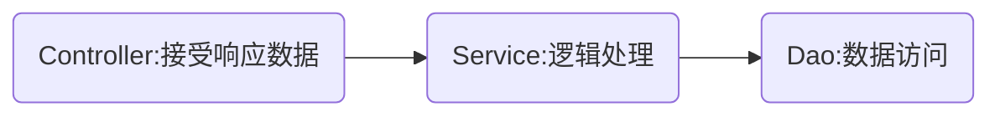
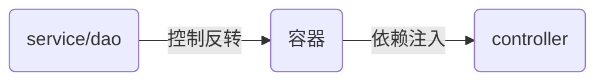
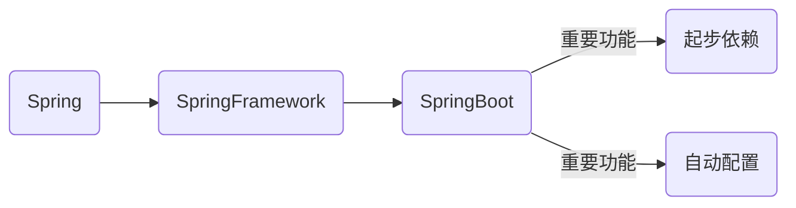
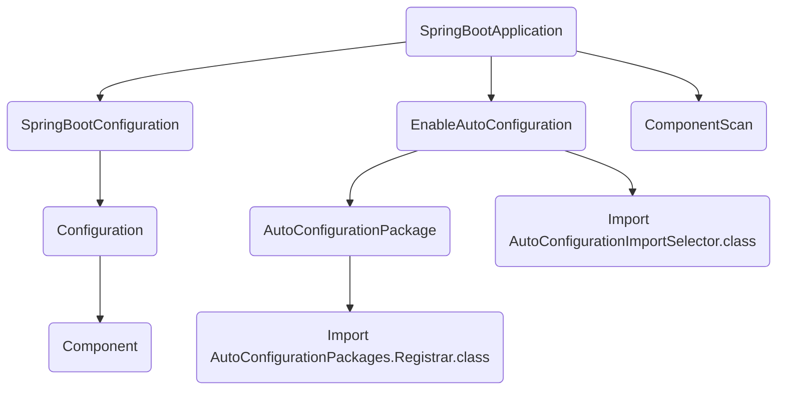
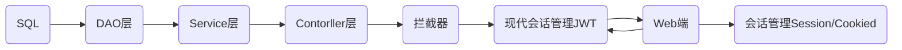

# SpringBoot框架

## 获取请求参数

### 简单参数

将参数名作为形参即可获取

请求链接为`http://localhost:8080/user?name=zhangsan&age=18`

>只需保证请求参数名称和形参名称相同即可,不相同不会报错但会返回null

```java
@RequestMapping("/user")
public String user(String name,Integer age) {
    return (name + "\t" + age);
}
```

- 获取简单参数
  - @RequestParams注解:可将参数名转化成别名
    - name:实际请求链接中的参数
    - **required**:是否必须,默认为true,若请求链接未带参数则返回400状态值
    - defaultValue:设置默认参数

```java
@RequestMapping("/user")
public String helloWorld(@RequestParam(name = "name",required = false) String username, Integer age) {
    return (username + "\t" + age);
}
```

### 实体参数

若参数众多,不方便管理,此时就可将参数封装成实体(POJO)

- User.java

```java
@Data
public class User {
    private String name;
    private Integer age;
}
```

- Controller.java

```java
@RequestMapping("/pojo")
public String pojo(User user) {
    return user;
}
```

>参数可以嵌套,例如address.province和address.city

### 数组集合参数

>请求参数名和形参数组名相同且请求参数多个,定义数组类型形参即可接收参数

- 获取数组参数
  - 使用数组来作为形参

```java
@RequestMapping("/array")
public String array(String[] checkbox) {
    System.out.println(Array.toString(checkbox)); //输出[参数1,参数2...]
    return "OK"
}
```

- 获取集合参数
  - 集合一定要有@RequestParams修饰

```java
@RequestMapping("/list")
public String list(@RequestParams List<String> list) {
    System.out.println(list); //输出[参数1,参数2...]
    return "OK"
}
```

### 日期参数

- 获取日期参数
  - 使用@DateTimeFormat注解设置接收参数的格式
  - 使用LocalDateTime类设置参数

```java
@RequestMapping("/date")
public String date(@DateTimeFormat(pattern = "yyyy-MM-dd HH:mm:ss")LocalDateTime localDateTime) {
    return localDateTime.toString();
}
```

### JSON参数

在Postman中发送JSON参数需要使用post方式,并且使用raw的JSON格式

- 获取JSON数据
  - POJO类中的变量名必须和参数相同
  - 使用@RequestBody注解

```java
@RequestMapping("/json")
public String json(@RequestBody User user) {
    return user.toString;
}
```

### 路径参数

将路径作为参数,例:`http://localhost:8080/path/1/zhangsan`

```java
@RequestMapping("/path/{id}/{name}")
public String path(@PathVariable Integer id,@PathVariable String name) {
    return id + name;
}
```

## 设置响应参数

### @ResponseBody

- 类/方法注解
  - 放在Controller方法/类上
  - 将返回值直接响应,若返回值是对象或集合,则先转成JSON在相应
  - @RestController = @Controller + @ResponseBody

### 响应格式

- 响应的返回值各种各样不方便前端对其进行解析,此时就需要一个统一的返回格式

- Result.java

```java
package com.mel0ny.springboot.pojo;

import lombok.AllArgsConstructor;
import lombok.Data;
import lombok.NoArgsConstructor;

@Data
@AllArgsConstructor
@NoArgsConstructor
public class Result {
    private Integer id;
    private String msg;
    private Object data;

    public static Result success() {
        return new Result(1,"success",null);
    }

    public static Result success(Object data){
        return new Result(1,"success",data);
    }

    public static Result success(String msg,Object data) {
        return new Result(1,msg,data);
    }

    public static Result error() {
        return new Result(0,"error",null);
    }

    public static Result error(Object data){
        return new Result(0,"error",data);
    }

    public static Result error(String msg,Object data) {
        return new Result(0,msg,data);
    }
}
```

- Controller.java

```java
@RequestMapping("/path/{id}/{name}")
public Result path(@PathVariable Integer id, @PathVariable String name) {
    return Result.success("id="+ id + " name=" + name);
}
```

## 分层解耦

为了保证项目维护起来更容易,代码复用率更高,通常遵循单一职责原则

- 单一职责原则的不同层次:
  - 数据访问
  - 逻辑处理
  - 接受请求响应数据

### 三层架构


```mermaid
graph LR
A(Controller:接受响应数据) --> B(Service:逻辑处理) --> C(Dao:数据访问)
```

- Dao、Service
  - 数据访问的方式不同:文件,接口(api),数据库……
  - 通常定义不同方式的接口并创建实现类

### 分层解耦解析

- 内聚:各个功能模块内部的功能关系
- 耦合:衡量软件各个层/模块之间的依赖、关联程度
- 软件设计原则:高内聚低耦合

如何降低耦合?
利用容器:将service/dao层中的对象实例化放到容器当中,controller再根据需要从容器中去除对象使用


```mermaid
graph LR
A(service/dao) --> |控制反转|B(容器) --> |依赖注入|C(controller)
```

- 控制反转(Inversion Of Control):IOC,将对象的创建控制权由程序自身转移到外部(容器)
- 依赖注入(Dependency Inject):DI,容器为应用程序提供运行时,所以来的资源
- Bean对象:IOC容器中创建,管理的对象,称为Bean

将service/dao层的实现类交给容器管理的方法:在类名上加@Component注解
将实现类注入到容器当中的方法:在定义字段上加@Autowired

#### IOC

IOC中的对象称为Bean对象

>所有Bean对象的开头都是小写

- Bean的声明
  - @Component:不属于controller,service,repository
  - @Controller:标注在控制器上
  - @Service:标注在业务类上
  - @Repository:标注在数据访问类上(很少用)
- Bean组件扫描
  - 默认扫描位置是启动类所在包和子包

#### DI

- 注入声明
  - @Autowired:自动装配到初始化对象当中
- 多个相同类型的Bean的注入方法
  - @Primary:在Bean声明上增加,表示注入当前类
  - @Qualifier:用名称的方式指定,例如@Qualifier("empService"),要和@Autowired一起使用
  - @Resource:和@Qualifier相同,但前者是根据类型注入,后者是根据名称注入,方式为@Resource(name="empService")

## AOP面向切面编程

- 概念
  - 连接点(JointPoint):可以被切面控制的具体方法(通过注解制定方法)
  - 通知(Advice):各个连接点的共性方法(可重复方法,aop方法内具体逻辑)
  - 切入点(PointCut):匹配连接点的条件(过滤条件,注解实现)
  - 切面(Aspect):以上三个概念形成的方法(aop内方法)
  - 目标(Target):通过切入点匹配的对象(注解制定)

>底层通过动态代理+插入代码实现

### 通知类型

- 通知通过注解实现
  - @Around:在通知点前后执行代码
  - @Before:在通知点之前执行代码
  - @After:在通知点之后执行代码,抛出错误也会执行
  - @AfterReturning:同@After,抛出错误之后不会执行
  - @AfterThrowing:在抛出错误之后才会执行

@Around注解需要配置形参**ProceedingJoinPoint**,并且需要调用其方法

```java
@Around("execution (切点表达式))")
public Object method(ProceedingJoinPoint process) {
    //执行前方法

    Object proceed = joinPoint.proceed();

    //执行后方法

    return proceed;
}
```

当切点表达式重复过多可使用@PointCut抽象出来

```java
@PointCut("execution (切点表达式)")
private void pointCut();
```

### 通知顺序

当多个切面匹配到同一个切入点时候执行方法的顺序

规则:字母顺序排前的@Before先执行,字母顺序排前的@After后执行

>可以使用@Order注解设置,数字越小越先执行

### 切入点表达式

- 常见形式
  - execution(...):根据方法签名匹配
  - @annotation(...):根据方法注解匹配

#### execution

`execution(访问类型? 返回值? 包名.类名.?方法名(方法参数) throws 异常?)`

通配符:`execution(* com.github.project.*.*(*/..))` $->$指在project包下的所有类的所有方法中的(单个/多个参数)

也可使用||等逻辑符链接多个切入点表达式

#### @annotation

`@annotation(包名)`

### 连接点

#### JoinPoint

对于@Around只能使用ProcessJoinPoint获取信息,其他均可以使用JoinPoint获取

```java
import org.aspectj.lang.JoinPoint;
import org.aspectj.lang.ProceedingJoinPoint;
import org.aspectj.lang.annotation.*;
import org.springframework.stereotype.Component;

import java.util.Arrays;

@Aspect
@Component
public class JoinPointAspect {

   // ========== JoinPoint 示例（前置通知）==========
   @Before("execution(* com.example.service.*.*(..))")
   public void beforeAdvice(JoinPoint joinPoint) {
       System.out.println("=== JoinPoint 方法 ===");
       
       // 基础信息
       System.out.println("方法名: " + joinPoint.getSignature().getName());
       System.out.println("参数: " + Arrays.toString(joinPoint.getArgs()));
       System.out.println("目标类: " + joinPoint.getTarget().getClass().getSimpleName());
       System.out.println("代理类: " + joinPoint.getThis().getClass().getSimpleName());
       
       // 签名详情
       org.aspectj.lang.reflect.MethodSignature signature = 
           (org.aspectj.lang.reflect.MethodSignature) joinPoint.getSignature();
       System.out.println("返回类型: " + signature.getReturnType());
       System.out.println("参数类型: " + Arrays.toString(signature.getParameterTypes()));
       
       // 反射获取 Method
       java.lang.reflect.Method method = signature.getMethod();
       System.out.println("Method对象: " + method.getName());
       
       // 连接点类型
       System.out.println("Kind: " + joinPoint.getKind());
   }

   // ========== ProceedingJoinPoint 示例（环绕通知）==========
   @Around("execution(* com.example.service.*.*(..))")
   public Object aroundAdvice(ProceedingJoinPoint pjp) throws Throwable {
       System.out.println("=== ProceedingJoinPoint 方法 ===");
       
       // 继承自 JoinPoint 的所有方法都能用
       System.out.println("方法名: " + pjp.getSignature().getName());
       System.out.println("参数: " + Arrays.toString(pjp.getArgs()));
       
       // ProceedingJoinPoint 特有方法
       System.out.println("目标对象: " + pjp.getTarget());
       
       // 1. 获取方法签名（强制转换）
       org.aspectj.lang.reflect.MethodSignature signature = 
           (org.aspectj.lang.reflect.MethodSignature) pjp.getSignature();
       
       // 2. 获取参数名（需编译带 -parameters 或 -g）
       String[] paramNames = signature.getParameterNames();
       if (paramNames != null) {
           for (int i = 0; i < paramNames.length; i++) {
               System.out.println("参数名 " + paramNames[i] + " = " + pjp.getArgs()[i]);
           }
       }
       
       // 3. 修改参数（创建新数组）
       Object[] args = pjp.getArgs();
       if (args.length > 0 && args[0] instanceof String) {
           args[0] = "修改后的" + args[0];
       }
       
       // 4. 执行目标方法（关键！不调用则方法不执行）
       long start = System.currentTimeMillis();
       Object result = pjp.proceed(args);  // 使用修改后的参数
       long end = System.currentTimeMillis();
       
       System.out.println("执行耗时: " + (end - start) + "ms");
       System.out.println("返回值: " + result);
       
       // 5. 修改返回值
       if (result instanceof String) {
           result = ((String) result).toUpperCase();
       }
       
       return result;
   }

   // ========== AfterReturning 获取返回值 ==========
   @AfterReturning(pointcut = "execution(* com.example.service.*.*(..))", returning = "result")
   public void afterReturning(JoinPoint joinPoint, Object result) {
       System.out.println("返回值: " + result);
   }

   // ========== AfterThrowing 获取异常 ==========
   @AfterThrowing(pointcut = "execution(* com.example.service.*.*(..))", throwing = "ex")
   public void afterThrowing(JoinPoint joinPoint, Exception ex) {
       System.out.println("异常类型: " + ex.getClass().getSimpleName());
       System.out.println("异常信息: " + ex.getMessage());
   }
}
```

## Bean管理

使用ApplicationContext接口获取Bean信息

```java
@Autowired
private ApplicationContext applicationContext;
```

### 获取Bean对象

- getBean重载方法
  - getBean(String name);
  - getBean(Class<?> type);
  - getBean(String name,Class<?> type);

>ApplicationContext中还有其他获取Bean信息的方法

### Bean的作用域

使用注解@Scope设置作用域

|作用域|说明|
|:--:|:--:|
|singleton|单例模式|
|prototype|每次使用该Bean都会重新创建一个Bean对象|
|request|每个请求范围都会创建一个Bean对象|
|session|回个会话范围都会创建一个Bean对象|
|application|每个应用范围都会创建一个Bean对象|

### 配置第三方Bean

若Bean对象来自第三方(不可修改),则需要注解@Bean设置第三方Bean

```java
@Configuration
public class OshiConfig {

    @Bean
    public SystemInfo systemInfo() {
        return new SystemInfo();
    }
}
```

## SpringBoot原理

Spring家族


```mermaid
graph LR
A(Spring) --> B(SpringFramework) -->C(SpringBoot) -->|重要功能|D(起步依赖)
C -->|重要功能|E(自动配置)
```

### 起步依赖

maven配置有依赖传递的特性,因此只需要在`pom.xml`中引入`spring-boot-starter-web`依赖即可完成springboot的配置

### 自动配置

自动配置:当springboot启动后,引入的依赖或者手动编写的Bean对象自动导入到spring的ioc容器当中

- 设置方案
  - 方案一:使用@ComponentScan(String[] args)注解扫描第三方依赖中的Bean
  - 方案二:使用@Import({Class<> clazz})注解
  - 方案三:导入ImportSelector的实现类(本质是返回String数组)
  - 方案四:使用@EnableXXX注解(本质是开启封装类@Import注解)

底层注解使用:


```mermaid
graph TD

A(SpringBootApplication) -->B(SpringBootConfiguration)
A --> C(EnableAutoConfiguration)
A --> D(ComponentScan)

B --> E(Configuration) --> F(Component)
C --> G(AutoConfigurationPackage) --> H(Import AutoConfigurationPackages.Registrar.class)
C --> I(Import  AutoConfigurationImportSelector.class)
```

在AutoConfigurationImportSelector中实现了ImportSelector接口,实现了`selectImports()`方法

在AutoConfigurationImportSelector类中可以找到SpringBoot自动配置的位置文件:`META-INF/spring/ + this.autoConfigurationAnnotation.getName() + .imports`(旧版本会有一个`.factory`的文件)

### 条件自动配置

使用@Conditional及其子注解,在特定条件下才注入Bean

## 总结


```mermaid
graph LR
A(SQL) --> B(DAO层) -->C(Service层) --> D(Contorller层) -->F(拦截器) -->G(过滤器) -->E(Web端)
E --> H(会话管理Session/Cookied)
E --> G(现代会话管理JWT)
```
