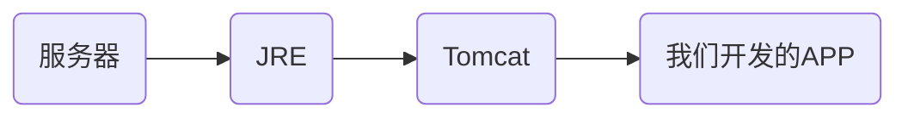
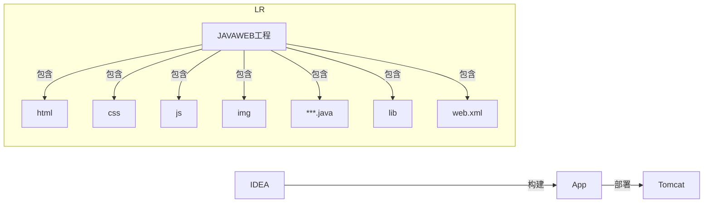
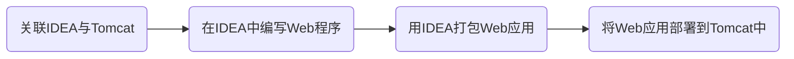

# Tomcat

服务器软件

当我们开发了服务器APP之后,需要将APP放在服务器中才能运行,服务器中需要有jre,jre中需要有Tomcat



>SpringBoot之所以能直接运行是因为SpringBoot中自带了Tomcat

- 常见的JavaWeb服务器:

- `Tomcat (Apache)`: 当前应用最广的JavaWeb服务器
- `Jetty`: 更轻量级、更灵活的servlet容器
- `JBoss (Redhat红帽)`: 支持JavaEE，应用比较广EJB容器 -&gt; SSH轻量级的框架代替
- `GlassFish (Oracle)`: Oracle开发JavaWeb服务器, 应用不是很广
- `Resin (Caucho)`: 支持JavaEE, 应用越来越广
- `Weblogic (Oracle)`: 要钱的! 支持JavaEE, 适合大型项目
- `Websphere (IBM)`: 要钱的! 支持JavaEE, 适合大型项目

## Tomcat标准APP目录结构

- 目录结构:

- WEB-INF(受保护的资源目录, 不可以通过浏览器直接访问的资源目录)
  - classes 字节码根路径
  - lib 依赖的存放路径
  - web.xml 项目的配置文件

- static
  - js
    - .js
  - img
    - .png
    - .jpeg
  - css
    - .css
  - page
    - .html

## Tomcat部署项目方式

- 方式1:
放在Tomcat根目录的`\webapps`下面

- 方式2:
随便在某个地方存放,在`\conf\Catalina\localhost`下创建`你的项目名称.XML`文件,然后在文件中添加配置:

```xml
<Content path="/你的项目名称" docBase="地址绝对路径(例:D:\WebApp\你的项目名称)" />
```

>注:在Tomcat自带的`webapp`中有个`ROOT`文件夹,当访问`localhost:8080`时默认访问的是`ROOT`文件夹下的资源

## IDEA关联Tomcat

JavaWeb流程:




